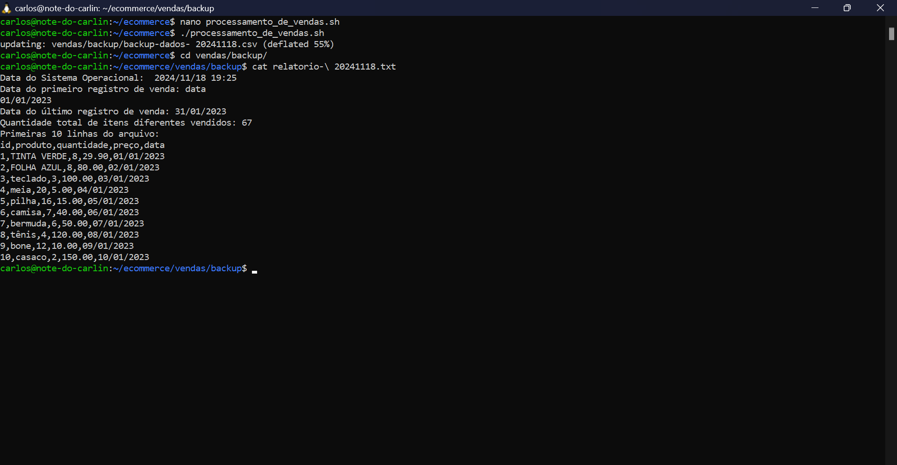
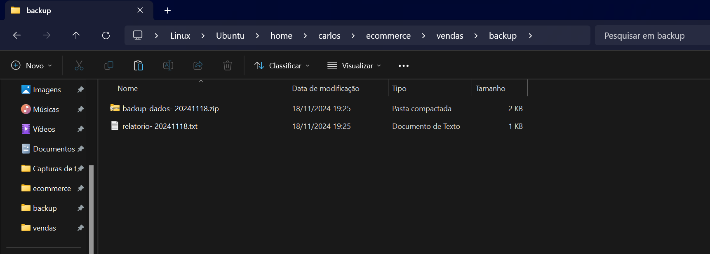
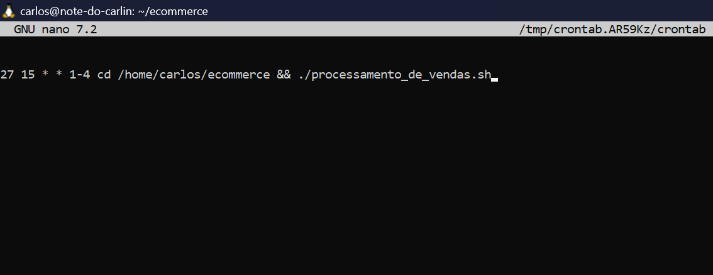
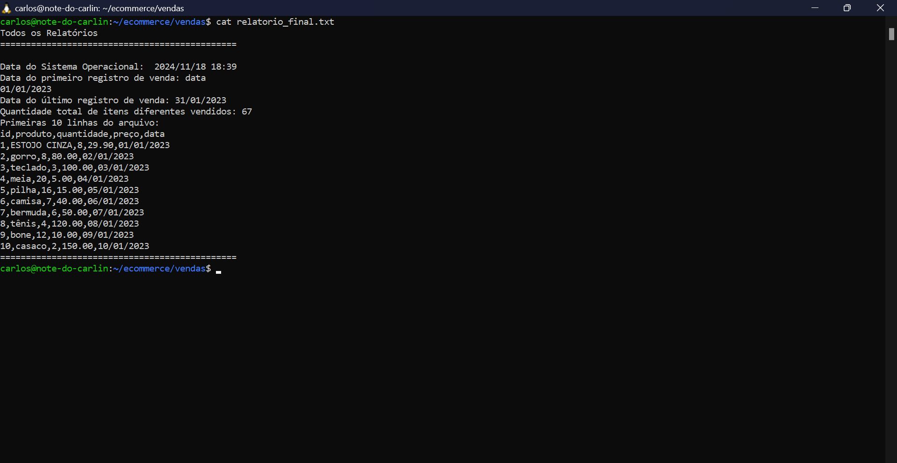
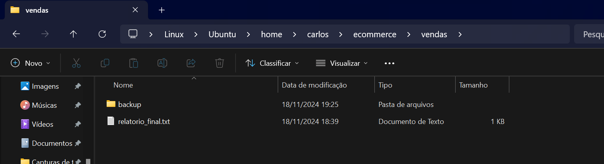

# Etapas


1. ... [Etapa I]

    Nessa etapa eu criei o algoritmo do arquivo executável "processamento de vendas", como está no código abaixo:
    ```
    #!/bin/bash

    # guardando o arquivo de vendas em uma variável
    arquivo_csv="dados_de_vendas.csv"

    # criando diretório vendas e subdiretório backup
    mkdir -p vendas/backup

    # armazenando a data de execução
    data_execucao=$(date '+ %Y%m%d')

    # copia o arquivo para o diretório vendas e renomeia
    cp "$arquivo_csv" vendas/"$arquivo.csv"

    # copia o arquivo para o dir backup e renomeia junto com a data
    cp "$arquivo_csv" vendas/backup/"dados-$data_execucao.csv"

    # renomeando o arquivo
    mv vendas/backup/"dados-$data_execucao.csv"  vendas/backup/"backup-dados-$data_execucao.csv"

    # criando relatorio.txt no backup
    relatorio=vendas/backup/"relatorio-$data_execucao.txt"

    # data do sistema operacional em formato YYYY/MM/DD HH:MM.
    data_sistema=$(date '+ %Y/%m/%d %H:%M')

    # pega a data do primeiro e último registro do arquivo
    primeira_data=$(head -n 2 vendas/backup/"backup-dados-$data_execucao.csv" | cut -d',' -f5)
    ultima_data=$(tail -n 1 vendas/backup/"backup-dados-$data_execucao.csv" | cut -d',' -f5)

    # quantidade total de itens diferentes vendidos
    quantidade_itens=$(cut -d',' -f2 vendas/backup/"backup-dados-$data_execucao.csv" | sort | uniq | wc -l)

    # pegando as primeiras 10 linhas
    primeiras_10_linhas=$(head -n 11 vendas/backup/"backup-dados-$data_execucao.csv")

    # criando o relatório e colocando tudo dentro do arquivo relatorio.txt
    {
        echo "Data do Sistema Operacional: $data_sistema" > "$relatorio"
        echo "Data do primeiro registro de venda: $primeira_data" >> "$relatorio"
        echo "Data do último registro de venda: $ultima_data" >> "$relatorio"
        echo "Quantidade total de itens diferentes vendidos: $quantidade_itens" >> "$relatorio"
        echo "Primeiras 10 linhas do arquivo:" >> "$relatorio"
        echo "$primeiras_10_linhas" >> "$relatorio"
    }

    # zipando o arquivo
    zip -r vendas/backup/"backup-dados-$data_execucao.zip" vendas/backup/"backup-dados-$data_execucao.csv"

    # removendo os arquivos
    rm vendas/backup/"backup-dados-$data_execucao.csv" vendas/.csv
    ```
    Obtive esse retorno do relatório funcionando:
    

    Aqui estão o arquivo já renomeado com a data de execução e zipado + o relatório.txt:
    

    E o código para conceder permissão de execução ao arquivo é esse: 
    ```
        chmod +x processamento_de_vendas.sh
    ```

2. ... [Etapa II]

    O objetivo da segunda etapa foi agendar a execução do código e para isso precisei usar o código abaixo:

    ```
        nano cron -e
    ```
    que abre o editor de código nano onde utilizei esse código para agendar para todos os dias de segunda a quinta às 15:27: 
    
    onde 27 representa a minutagem, 15 representa a hora;

    o primeiro "*" significa qualquer dia do mês e o segundo significa qualquer mês; 

    os números 1-4 representam os dias (começando segunda e repetindo até quinta); 

    o comando cd indica que ele deve acessar aquele caminho e o "&" indica que ele deve executar o arquivo logo após acessar o último diretório

3. ... [Etapa III]

    Nessa etapa o objetivo foi criar um outro arquivo executável para guardar todos os relatórios em um só lugar.

    Para isso usei o código:
     ```
      nano consolidador_de_processamento_de_vendas.sh
     ```
     Que abre o editor para então criar o script final:
      ```
       #!/bin/bash

        # Definir o diretório onde os relatórios estão localizados
        diretorio_relatorios="vendas/backup"

        # Arquivo de saída para o relatório final
        relatorio_final="vendas/relatorio_final.txt"

        > "$relatorio_final"

        # início do relatorio_final
        echo "Todos os Relatórios" >> "$relatorio_final"
        echo "==============================================" >> "$relatorio_final"
        echo "" >> "$relatorio_final"

        # procura por todos os arquivos de relatório .txt no diretório de backup
        for relatorio in "$diretorio_relatorios"/*.txt; do

                cat "$relatorio" >> "$relatorio_final"
                echo "==============================================" >> "$relatorio_final"  # Adiciona uma linha entre os relatórios

        done
      ``` 
    Onde esse é o retorno:
    

    OBS: Só está sendo listado um único relatório pois cada novo relatório diário é renomeado automaticamente com a data de execução dele (visivel no código da primeira etapa; fiz isso para que ficasse visível o relatório específico de cada dia) e como eu só consegui fazer os relatórios hoje todos ficaram com a mesma data, logo, com o mesmo nome e assim eles se sobrescreveram. 

    E aqui está o arquivo .txt:
    

     E o código para conceder permissão de execução ao arquivo é esse: 
    ```
        chmod +x consolidador_de_processamento_de_vendas.sh
    ```