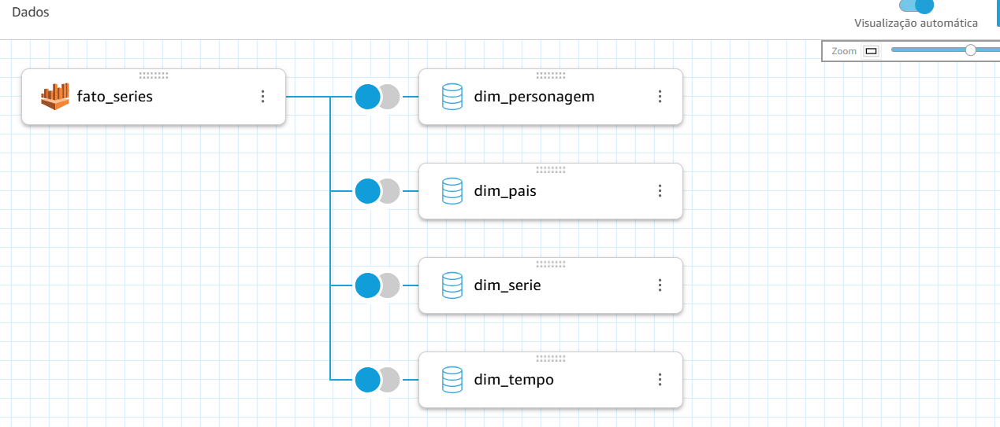
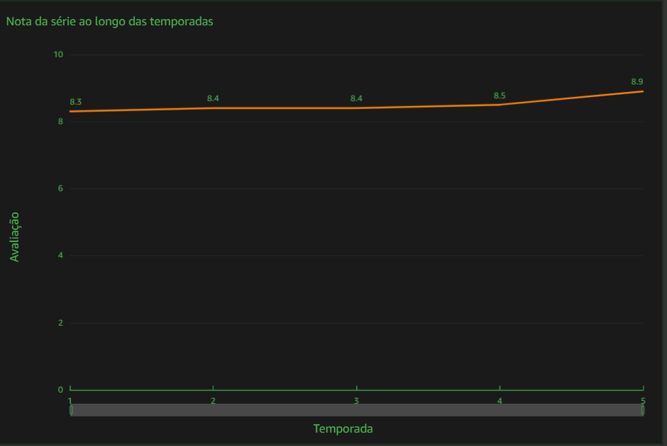
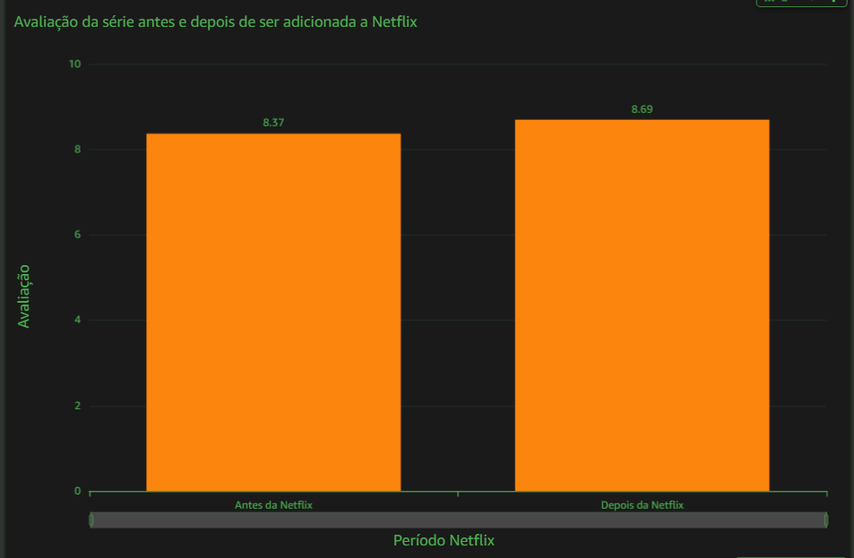
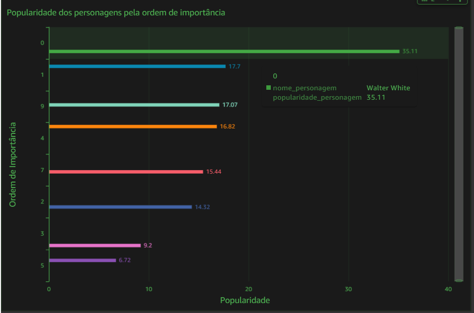
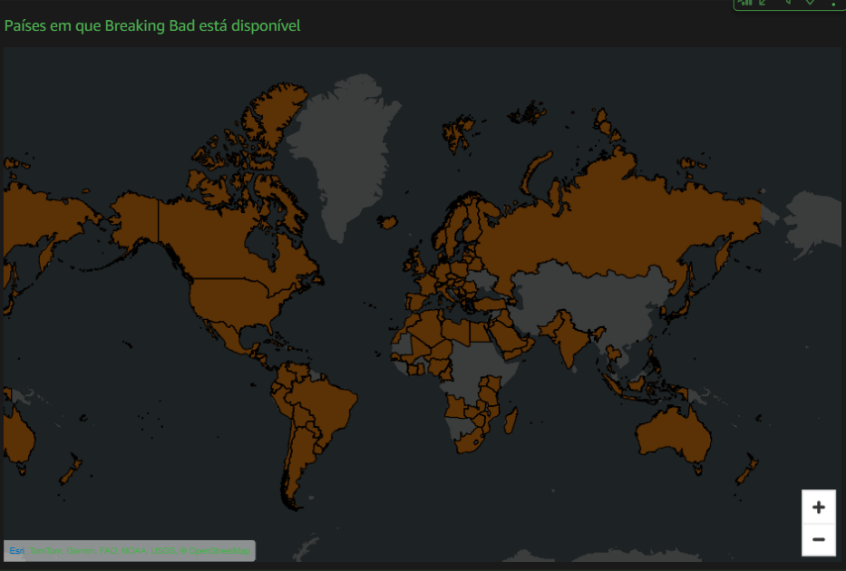
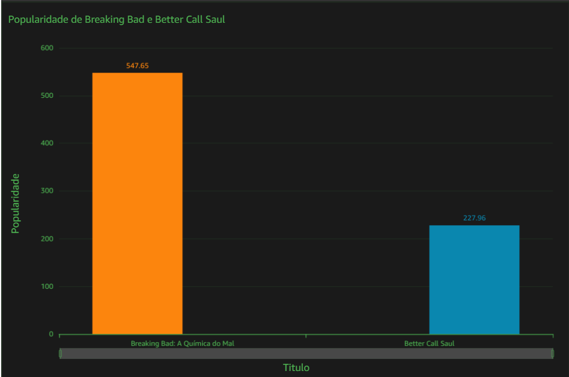
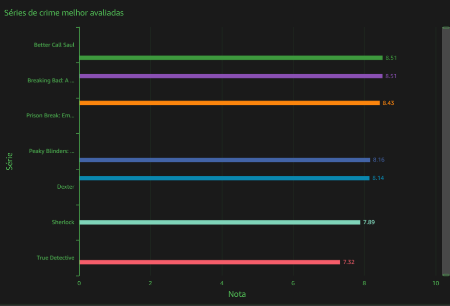

# Perguntas para serem analisadas:

    - Qual foi a trajetória de desempenho da série ao longo das temporadas?
    - Ser adicionada a Netflix trouxe impactos positivos ou negativos? 
    - A importância do personagem influencia no sucessso com o público?
    - O spin-off de Breaking Bad (Better Call Saul) teve tanto sucesso quanto a série primária? 
    - Como Breaking Bad se compara a outras séries de crime?

# Objetivo: Desenvolver o dashboard dos dados coletados e processados, utilizando o AWS QuickSight

## Etapa 1 - Criar DataSets 

Para isso eu criei um DataSet para cada Dimensão e por último criei o DataSet da Fatos onde juntei fiz os joins com todos os outros DataSets 
### DataSets criados:

### Fato com todos os dados:

## Etapa 2 - Criação dos gráficos

O primeiro gráfico escolhido foi um de linhas que mostra a nota de cada temporada, o que deixa claro, com o aumento gradativo das notas, como a série evoluiu com o tempo. 
 

O segundo gráfico foi analisando a série antes de ser adicionada a Netflix, enquanto ainda era transmitida na TV e após ser adicionada, e podemos concluir que sua compra pela Netflix trouxe impactos reais e positivos, que podem ser vistos pela avaliação média da série subir após isso. Esse fato pode se dar por alguns fatores, como investimento maior e principalmente mais audiência, por conta do serviço de streaming abrangir o mundo inteiro.

A terceira análise foi para avaliar se a ordem de importância do personagem influencia na sua populariade com o público. Como pode ser visto no gráfico, na série em questão isso não influencia pois está claro que mesmo personagens "menos importantes" são mais adorados pelo público do que outros de maior importância, visto que quanto menor o número correspondente a ordem de importância, mais importante ele é na série, com o personagem de número 0 sendo o principal.

Para encerrar a análise unicamente voltada para a série escolhida escolhi um gráfico geográfico que mostra todos os países abrangidos por Breaking Bad.
 

Na última parte do Dashboard coloquei lado a lado duas séries em comum, Breaking Bad e Better Call Saul, um Spin-off de Breaking Bad que ganhou 6 temporadas. Um fato curioso é que mesmo Saul Goodman não sendo um dos personagens principais, ele ganhou certo carinho pelos fãs da série, mas a motivação da sua série própria é que segundo as palavras do próprio criador de Breaking Bad "Vince Gilligan", ele gostava da ideia de um seriado sobre advogados em que o principal faria qualquer coisa para ficar fora de um tribunal.

E para finalizar esse dashboard, trouxe um gráfico de linhas verticais analisando as top 7 séries do gênero crime mais bem avaliadas no IMDB, onde Breaking Bad e Beter Call Saul, empatadas, são as duas séries com a maior nota de seu gênero, o que mostra o quanto Breaking Bad é amada pelo público, ao ponto de não somente ser a série com a maior nota, mas também levar seu Spin-off junto para o topo.
  

E para complementar a análise eu trouxe alguns cards com informações importantes sobre a série escolhida no início do dashboard
 

## E o gráfico completo pode ser visto aqui: [Dashboard-Breaking_Bad](./Breaking_Bad_dash.pdf)