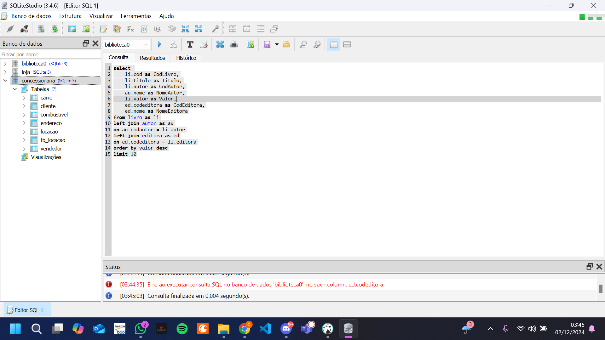
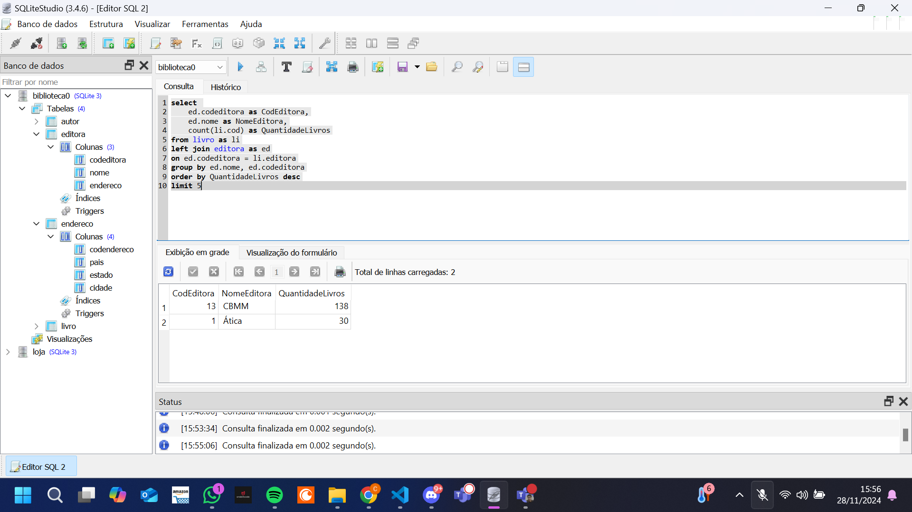

# Resumo

**Sql:** O curso de Sql foi muito bom para aprender melhor a usar select e joins e aprender sobre subquery pois o restante mais básico eu já tinha visto previamente na faculdade.

**AWS Skill Builder:** O curso de AWS

# Exercícios

## Exercícios - case de estudo Biblioteca

### Exercício 01 

[Ex_01](exercicios/case_de_estudo-biblioteca/ex_01.txt)

### Exercício 02 

[Ex_02](exercicios/case_de_estudo-biblioteca/ex_02.txt)

### Exercício 03 

[Ex_03](exercicios/case_de_estudo-biblioteca/ex_03.txt)

### Exercício 04 

[Ex_04](exercicios/case_de_estudo-biblioteca/ex_04.txt)

### Exercício 05 

[Ex_05](exercicios/case_de_estudo-biblioteca/ex_05.txt)

### Exercício 06 

[Ex_06](exercicios/case_de_estudo-biblioteca/ex_06.txt)

### Exercício 07 

[Ex_07](exercicios/case_de_estudo-biblioteca/ex_07.txt)

## Exercícios - case de estudo Loja

### Exercício 08 

[Ex_08](exercicios/case_de_estudo-loja/ex_08.txt)

### Exercício 09 

[Ex_09](exercicios/case_de_estudo-loja/ex_09.txt)

### Exercício 10 

[Ex_10](exercicios/case_de_estudo-loja/ex_10.txt)

### Exercício 11 

[Ex_11](exercicios/case_de_estudo-loja/ex_11.txt)

### Exercício 12 

[Ex_12](exercicios/case_de_estudo-loja/ex_12.txt)

### Exercício 13

[Ex_13](exercicios/case_de_estudo-loja/ex_13.txt)

### Exercício 14 

[Ex_14](exercicios/case_de_estudo-loja/ex_14.txt)

### Exercício 15 

[Ex_15](exercicios/case_de_estudo-loja/ex_15.txt)

### Exercício 16 

[Ex_16](exercicios/case_de_estudo-loja/ex_16.txt)

## Exercícios - Exportação de dados

Nesse exercício eu fiz uma query para obter os 10 livros mais caros trazendo todas as colunas pedidas:

[Etapa 1](exercicios/exportacao_de_dados/etapa_1.csv)

Nessa query eu  listei as 5 editoras com maior quantidade de livros na biblioteca:

[Etapa 2](exercicios/exportacao_de_dados/etapa_2.csv)

OBS: ele só retorna duas editoras pois na tabela livro só contém esses dois IDs

# Evidências

## Exportação de dados

### Etapa 1

Nesse exercício eu fiz uma query para obter os 10 livros mais caros trazendo todas as colunas pedidas

### Etapa 02 

Nessa query eu  listei as 5 editoras com maior quantidade de livros na biblioteca

OBS: ele só retorna duas editoras pois na tabela livro só contém esses dois IDs

# Certificados

[AWS Partner Sales Accreditation](./certificados/AWS%20Partner%20Sales%20Accreditation%20(Carlos%20Alberto%20Alves%20Ribeiro).pdf)
