# Resumo

**Git Hub:** O curso de git hub foi essencial para a criação do repositório, entedimento acerca da organização de pastas e diretórios, aprendizado sobre a sintaxe do git e a importância de um bom git hub organizado para fácil entendimento de todos e compartilhamento de códigos de maneira fácil e prática.

**Linux:** O curso de linux me ensinou como viajar entre as pastas, criar, exluir e editar diretórios e arquivos, também aprendi sobre caminho das pastas que é uma das coisas mais primordiais para o cumprimento do desafio. Ele também me ensinou a usar os editores de texto nano e vim. 

# Exercícios

## Exercícios - case de estudo Biblioteca

### Exercício 01 

[Ex_01](exercicios/case_de_estudo-biblioteca/ex_01.txt)

### Exercício 02 

[Ex_02](exercicios/case_de_estudo-biblioteca/ex_02.txt)

### Exercício 03 

[Ex_03](exercicios/case_de_estudo-biblioteca/ex_03.txt)

### Exercício 04 

[Ex_04](exercicios/case_de_estudo-biblioteca/ex_04.txt)

### Exercício 05 

[Ex_05](exercicios/case_de_estudo-biblioteca/ex_05.txt)

### Exercício 06 

[Ex_06](exercicios/case_de_estudo-biblioteca/ex_06.txt)

### Exercício 07 

[Ex_07](exercicios/case_de_estudo-biblioteca/ex_07.txt)

## Exercícios - case de estudo Loja

### Exercício 08 

[Ex_08](exercicios/case_de_estudo-loja/ex_08.txt)

### Exercício 09 

[Ex_09](exercicios/case_de_estudo-loja/ex_09.txt)

### Exercício 10 

[Ex_10](exercicios/case_de_estudo-loja/ex_10.txt)

### Exercício 11 

[Ex_11](exercicios/case_de_estudo-loja/ex_11.txt)

### Exercício 12 

[Ex_12](exercicios/case_de_estudo-loja/ex_12.txt)

### Exercício 13

[Ex_13](exercicios/case_de_estudo-loja/ex_13.txt)

### Exercício 14 

[Ex_14](exercicios/case_de_estudo-loja/ex_14.txt)

### Exercício 15 

[Ex_15](exercicios/case_de_estudo-loja/ex_15.txt)

### Exercício 16 

[Ex_16](exercicios/case_de_estudo-loja/ex_16.txt)

## Exercícios - Exportação de dados

[Etapa 1](exercicios/exportacao_de_dados/etapa_1.csv)

[Etapa 2](exercicios/exportacao_de_dados/etapa_2.csv)

# Evidências

## Case Biblioteca

### Exercício 01 

Nessa query eu  listei todos os livros publicados após 2014

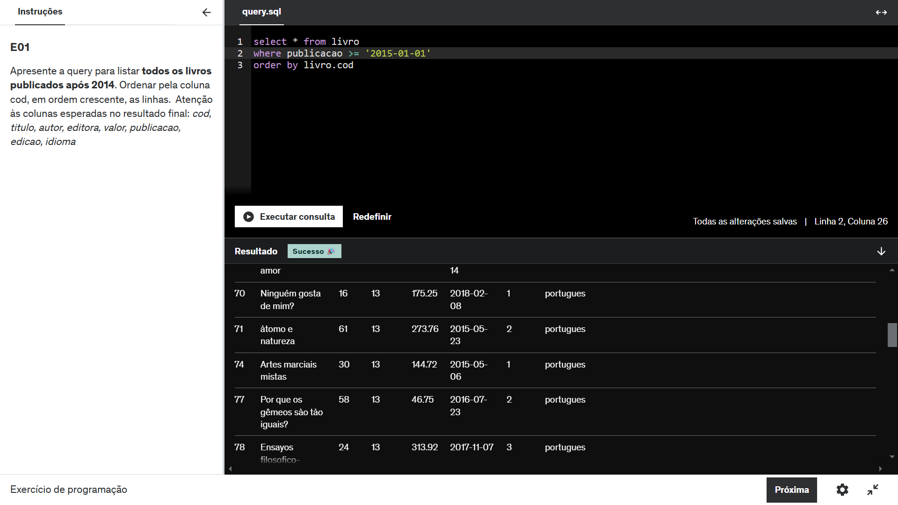

OBS: o resultado é maior porém não coube no print

### Exercício 02 

Nessa query eu  listei os 10 livros mais caros.

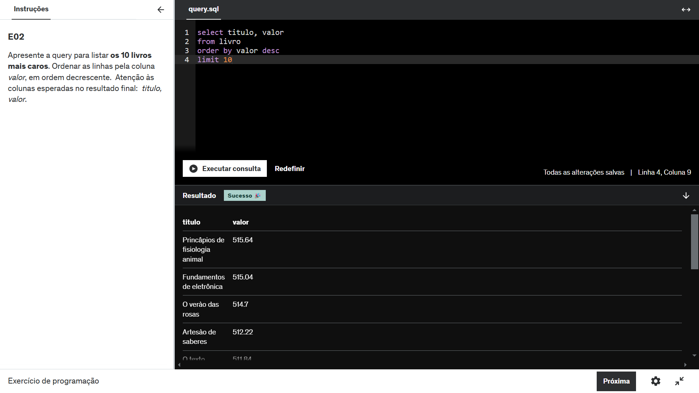

OBS: o resultado é maior porém não coube no print

### Exercício 03 

Nessa query eu  listei as 5 editoras com mais livros na biblioteca. 

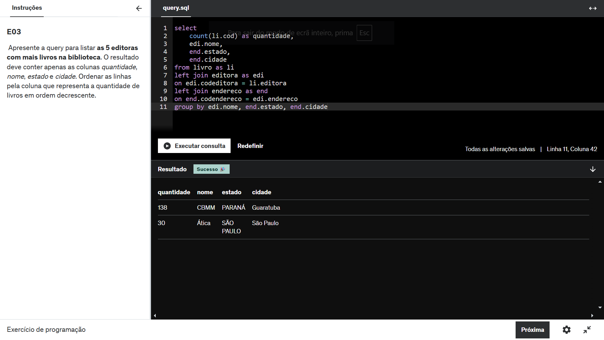

OBS: não foi necessário o uso do "limit 5" e nem de ordenar de forma decrescente para pegar as 5 com maior quantidade de livros pois na tabela "livro" só temos o id(foreign key) dessas únicas duas editoras

### Exercício 04 

Nessa query eu  listei todos os livros publicados após 2014

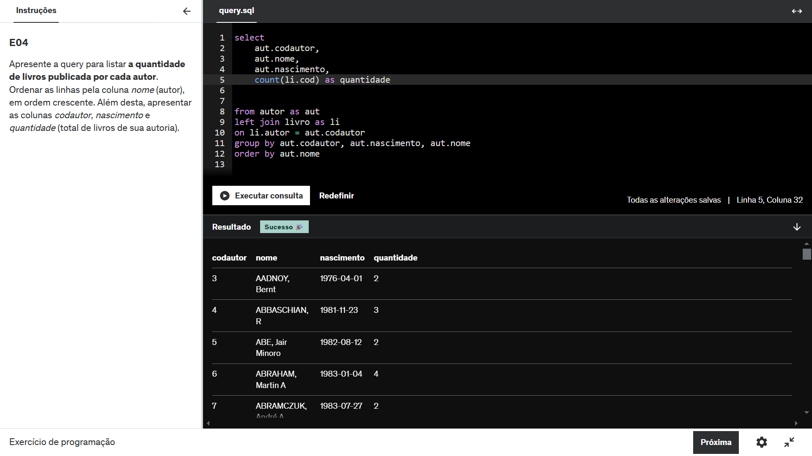

OBS: o resultado é maior porém não coube no print

### Exercício 05 

Nessa query eu  listei todos os livros publicados após 2014

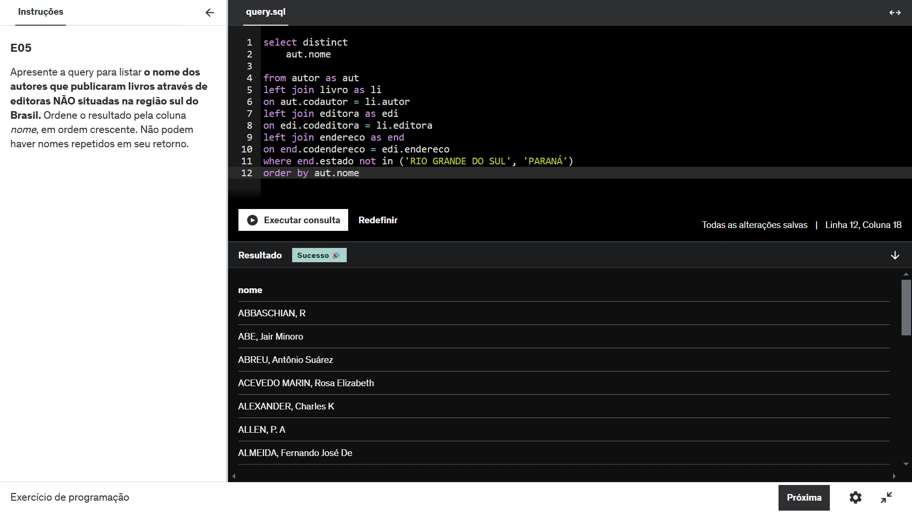

OBS: o resultado é maior porém não coube no print

### Exercício 06 

Nessa query eu  listei todos os livros publicados após 2014

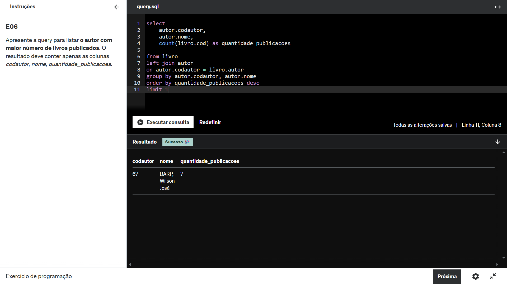

OBS: o resultado é maior porém não coube no print

### Exercício 07 

Nessa query eu  listei todos os livros publicados após 2014

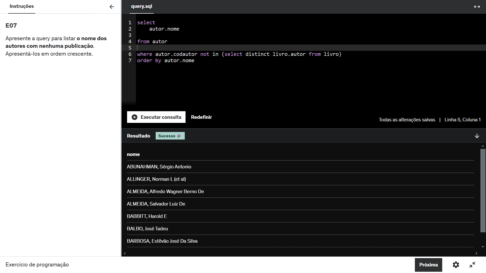

OBS: o resultado é maior porém não coube no print

## Case Loja

### Exercício 08 

Nessa query eu  listei todos os livros publicados após 2014

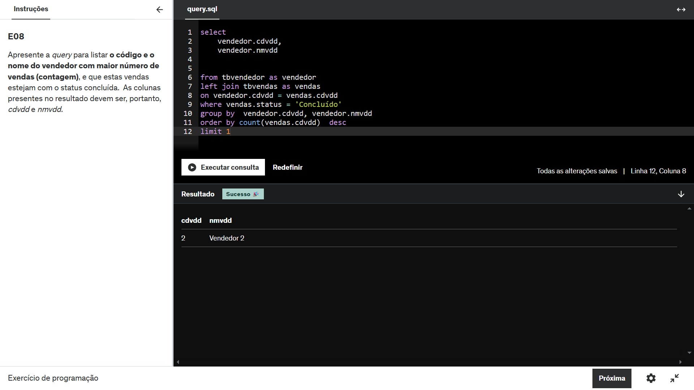

OBS: o resultado é maior porém não coube no print

### Exercício 09 

Nessa query eu  listei todos os livros publicados após 2014

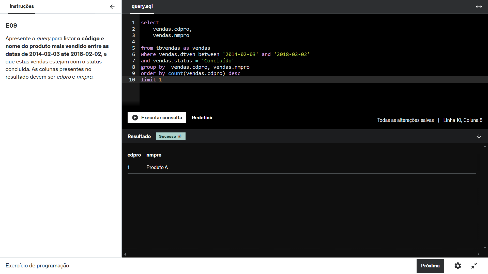

OBS: o resultado é maior porém não coube no print

### Exercício 10 

Nessa query eu  listei todos os livros publicados após 2014

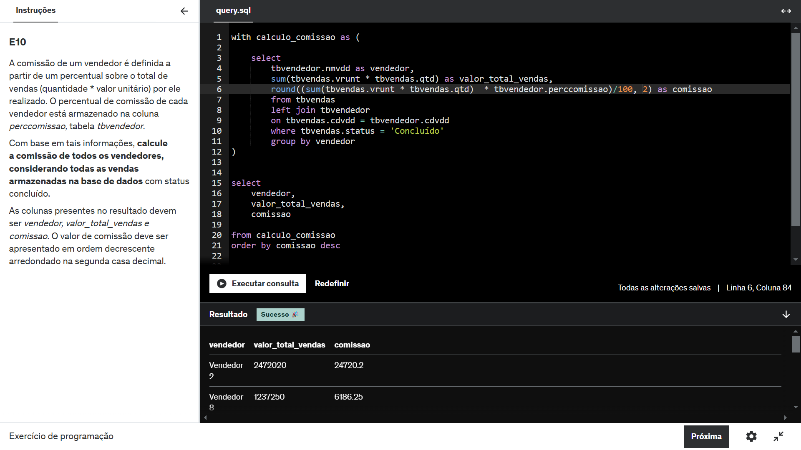

OBS: o resultado é maior porém não coube no print

### Exercício 11 

Nessa query eu  listei todos os livros publicados após 2014

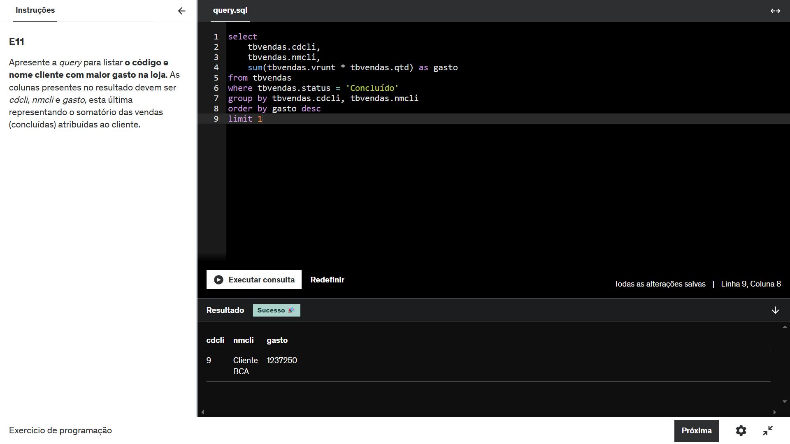

OBS: o resultado é maior porém não coube no print

### Exercício 12 

Nessa query eu  listei todos os livros publicados após 2014

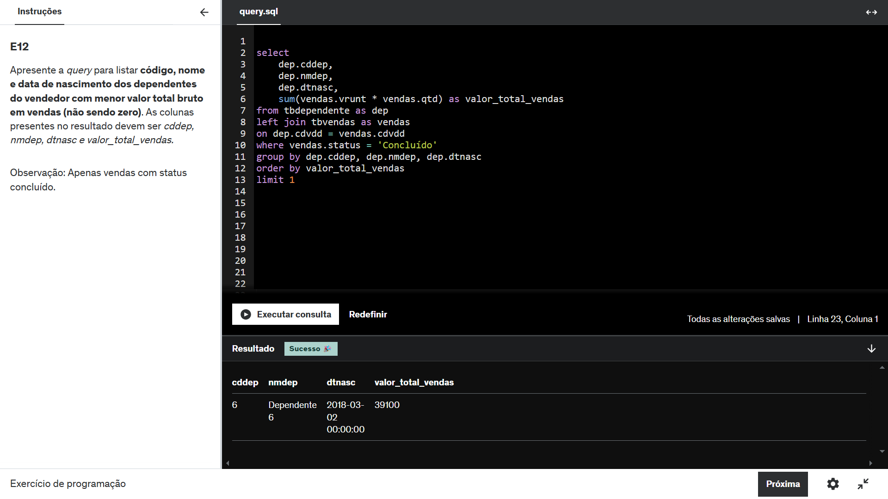

OBS: o resultado é maior porém não coube no print

### Exercício 13 

Nessa query eu  listei todos os livros publicados após 2014

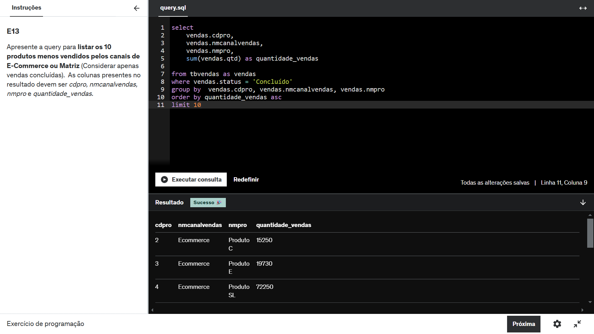

OBS: o resultado é maior porém não coube no print

### Exercício 14 

Nessa query eu  listei todos os livros publicados após 2014

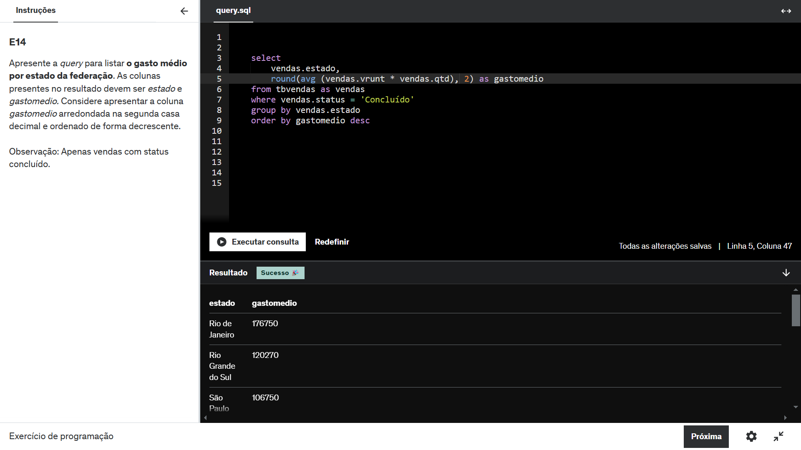

OBS: o resultado é maior porém não coube no print

### Exercício 15 

Nessa query eu  listei todos os livros publicados após 2014

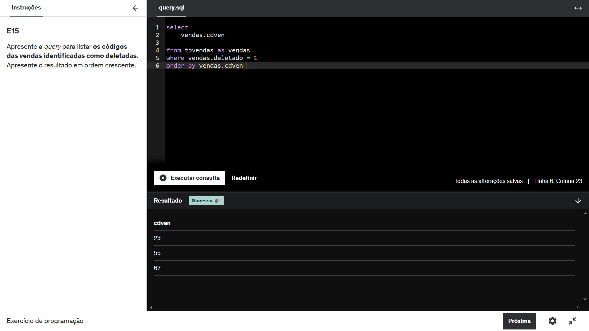

OBS: o resultado é maior porém não coube no print

### Exercício 16 

Nessa query eu  listei todos os livros publicados após 2014

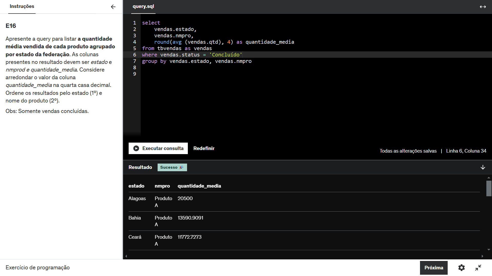

OBS: o resultado é maior porém não coube no print

# Certificados

Não houveram certificados extra Udemy nessa Sprint.
