# Etapas


1. ... [Etapa I]

    Nessa etapa eu fiz a normalização das tabelas, em acordo com as formas normais de forma que todos os dados fiquem bem visíveis
    ```
         ----Criando todas as tabelas normalizadas

        ----Tabela cliente
        create table cliente (

            idCliente integer primary key,
            nomeCliente varchar(255)
        );

        ----Tabela vendedor
        create table vendedor (

            idVendedor integer primary key,
            nomeVendedor varchar(255),
            sexoVendedor smallint
        );

        ----Tabela endereco
        create table endereco (
            
            idEndereco integer primary key autoincrement,
            cidadeCliente varchar(255),
            estadoCliente varchar(255),
            paisCliente varchar(255),
            estadoVendedor varchar(255),
            cliente integer,
            vendedor integer,
            FOREIGN KEY (cliente) REFERENCES cliente(idCliente),
            FOREIGN KEY (vendedor) REFERENCES vendedor(idVendedor)
        );


        ----Tabela combustivel
        create table combustivel (

            idCombustivel integer primary key, 
            tipoCombustivel varchar(255)
        );

        ----Tabela carro
        create table carro (

            idCarro integer primary key,
            kmCarro decimal(10, 2),
            classiCarro varchar(255),
            marcaCarro varchar(255),
            modeloCarro varchar(255),
            anoCarro integer,
            combustivel integer,
        FOREIGN KEY (combustivel) REFERENCES combustivel(idCombustivel)
        );

        ----Tabela locacao
        create table locacao (

            idLocacao integer primary key,
            dataLocacao datetime,
            horaLocacao time,
            qtdDiaria integer,
            vlrDiaria decimal(10, 2),
            dataEntrega date,
            horaEntrega time,
            codCliente integer,
            codVendedor integer,
            codCarro integer,
            FOREIGN KEY (codCLiente) REFERENCES cliente(idCliente),
            FOREIGN KEY (codVendedor) REFERENCES vendedor(idVendedor),
            FOREIGN KEY (codCarro) REFERENCES carro(idCarro)
        );


       
    ```
    
    

    E após isso importei os dados da tabela tb_locacao para as normalizadas:
    E após i
    ```
        ----Importando dados da tabela geral para cada tabela normalizada

        ----Inserindo dados na tabela cliente
        INSERT INTO cliente (idCliente, nomeCliente)
        select DISTINCT 
            idCliente,
            nomeCliente 
        FROM tb_locacao; 

        ----Inserindo dados na tabela vendedor
        INSERT INTO vendedor (idVendedor, nomeVendedor, sexoVendedor)
        select DISTINCT 
            idVendedor,
            nomeVendedor,
            sexoVendedor
        FROM tb_locacao;

        ----Inserindo dados na tabela endereco
        INSERT INTO endereco (cidadeCliente, estadoCliente, paisCliente, estadoVendedor, cliente, vendedor)
        select DISTINCT 
            cidadeCliente, 
            estadoCliente, 
            paisCliente, 
            estadoVendedor,
            idCliente,
            idVendedor
        FROM tb_locacao; 

        ----Inserindo dados na tabela combustivel
        INSERT INTO combustivel (idCombustivel, tipoCombustivel)
        select DISTINCT 
            idcombustivel,
            tipoCombustivel
        FROM tb_locacao; 

        ----Inserindo dados na tabela carro
        INSERT or REPLACE INTO carro ( idCarro, kmCarro, classiCarro, marcaCarro, modeloCarro, anoCarro, combustivel)
        select DISTINCT
            idCarro, 
            kmCarro, 
            classiCarro, 
            marcaCarro, 
            modeloCarro, 
            anoCarro, 
            idCombustivel
        FROM tb_locacao; 


        ----Inserindo dados na tabela locacao
        INSERT INTO locacao (idLocacao, dataLocacao, horaLocacao, qtdDiaria, vlrDiaria, dataEntrega, horaEntrega, codCliente, codVendedor, codCarro)
        select DISTINCT 
            idLocacao, 
            dataLocacao, 
            horaLocacao, 
            qtdDiaria, 
            vlrDiaria, 
            dataEntrega, 
            horaEntrega,
            idCliente,
            idVendedor,
            idCarro
        FROM tb_locacao; 

       
    ```
    E aqui estão os retornos das tabelas:

    Tabela Cliente

    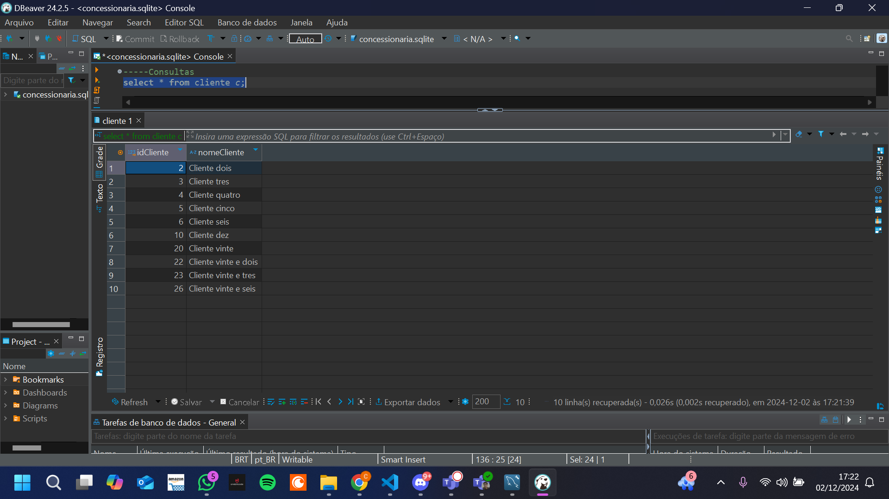

    Tabela Vendedor

    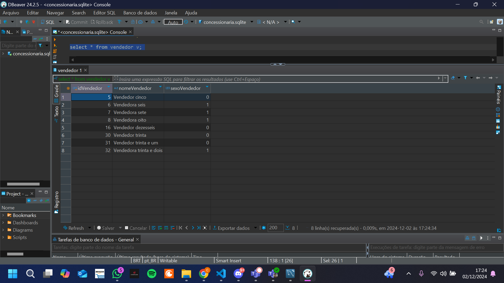

    Tabela Endereco

    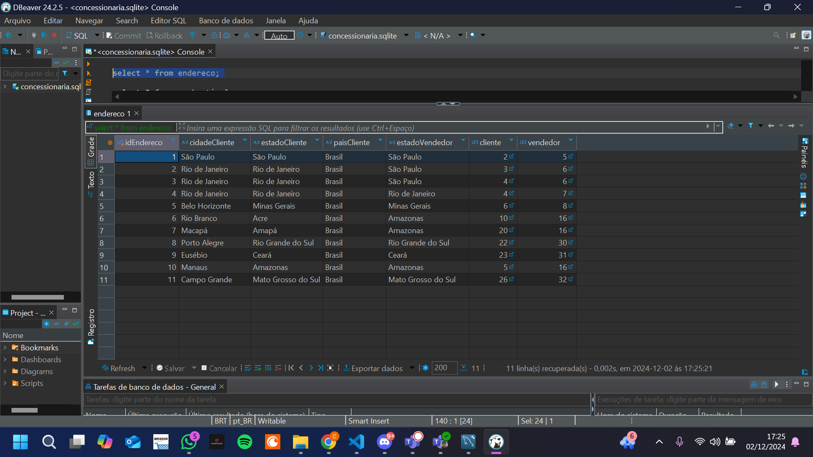

    Tabela Combustivel

    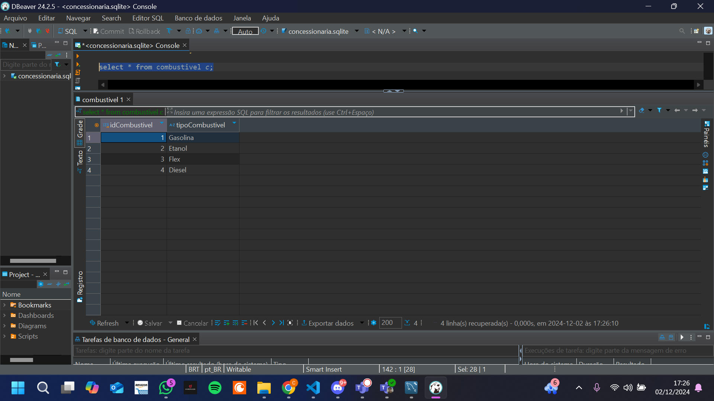

    Tabela Carro

    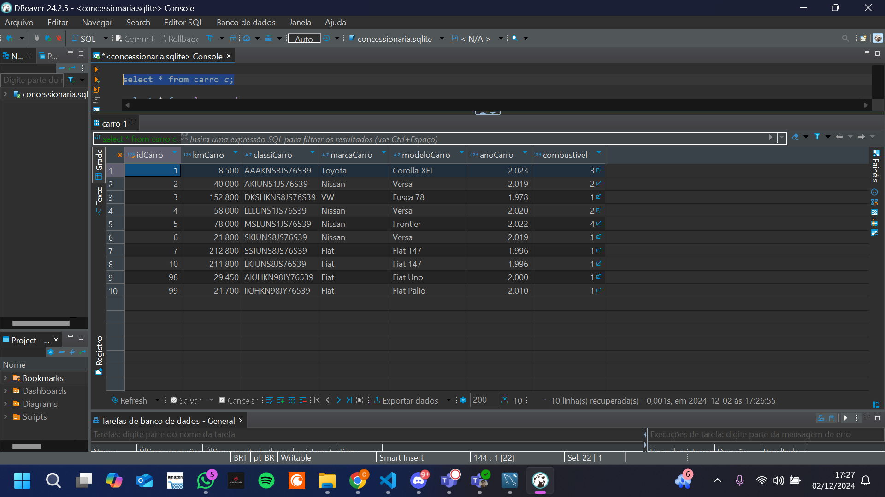

    Tabela Locacao

    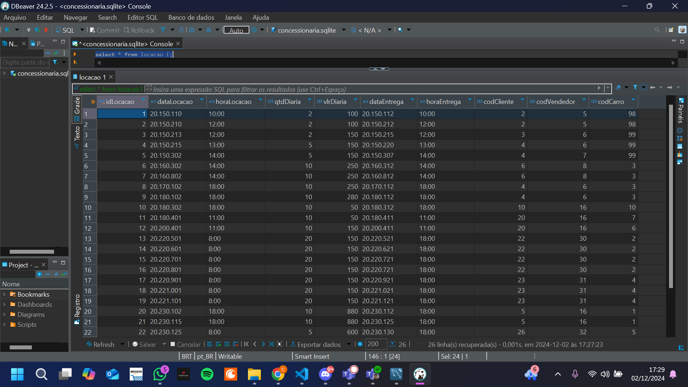

    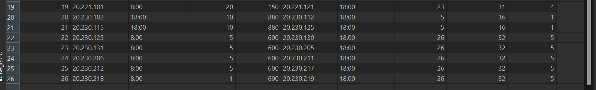


    E aqui está o modelo relacional:

  
    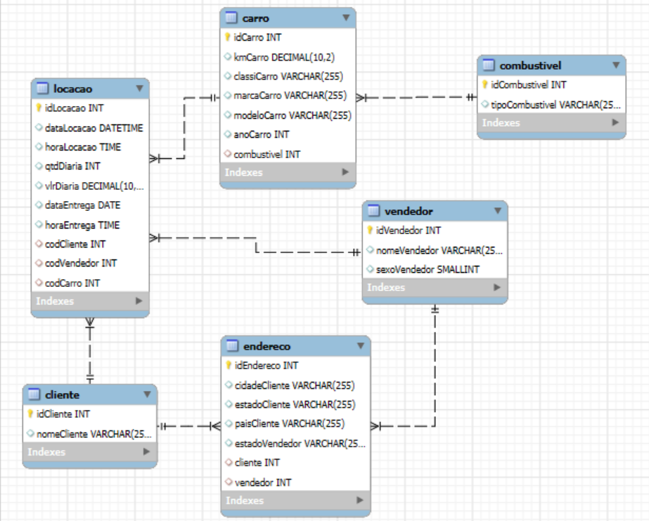


2. ... [Etapa II]

    O objetivo da segunda etapa foi a criação do modelo dimensional a partir do modelo relacional normalizado, onde a intenção desse modelo é facilitar as consultas

    O objetivo da segunda etapa foi
    ```
        ----Modelo dimensional 

        ----Criando Views

        ---Dimensão Cliente
        CREATE VIEW dim_cliente AS 
        select DISTINCT 
            cl.idCliente as codigo,
            cl.nomeCliente as nome,
            en.cidadeCliente as cidade,
            en.estadoCliente as estado,
            en.paisCliente as pais
        FROM cliente as cl
        left join endereco as en
        on cl.idCliente = en.cliente;


        ----Dimensão Carrro
        CREATE VIEW dim_carro AS 
        select DISTINCT 
            idCarro as codigoCarro,
            kmCarro as quilometragem,
            classiCarro as classificacao,
            marcaCarro as marca,
            modeloCarro as modelo,
            anoCarro as ano,
            idCombustivel as codigoCombustivel,
            tipoCombustivel as tipo
        FROM carro as ca
        left join combustivel as co
        on co.idCombustivel = ca.combustivel;


        ---Dimensão Vendedor
        CREATE VIEW dim_vendedor AS 
        select DISTINCT 
            ve.idVendedor as codigo,
            ve.nomeVendedor as nome,
            ve.sexoVendedor as sexo,
            en.estadoVendedor as estado
        FROM vendedor as ve 
        left join endereco as en
        on ve.idVendedor = en.vendedor;

        ----Dimensão Tempo
        CREATE VIEW dim_tempo AS 
        select DISTINCT 
            dataLocacao,
            STRFTIME('%Y', 	
                        SUBSTR(dataLocacao, 1, 4) || '-' || 
                        SUBSTR(dataLocacao, 5, 2) || '-' || 
                        SUBSTR(dataLocacao, 7, 2)) 
                    as anoLocacao,
            STRFTIME('%m', 
                        SUBSTR(dataLocacao, 1, 4) || '-' || 
                        SUBSTR(dataLocacao, 5, 2) || '-' || 
                        SUBSTR(dataLocacao, 7, 2)) 
                    as mesLocacao,
            STRFTIME('%d', 
                        SUBSTR(dataLocacao, 1, 4) || '-' || 
                        SUBSTR(dataLocacao, 5, 2) || '-' || 
                        SUBSTR(dataLocacao, 7, 2)) 
                    as diaLocacao,
            horaLocacao,
            dataEntrega,
            STRFTIME('%Y', 
                        SUBSTR(dataEntrega, 1, 4) || '-' || 
                        SUBSTR(dataEntrega, 5, 2) || '-' || 
                        SUBSTR(dataEntrega, 7, 2)) 
                    as anoEntrega,
            STRFTIME('%m', 
                        SUBSTR(dataEntrega, 1, 4) || '-' || 
                        SUBSTR(dataEntrega, 5, 2) || '-' || 
                        SUBSTR(dataEntrega, 7, 2)) 
                    as mesEntrega,
            STRFTIME('%d', 
                        SUBSTR(dataEntrega, 1, 4) || '-' || 
                        SUBSTR(dataEntrega, 5, 2) || '-' || 
                        SUBSTR(dataEntrega, 7, 2)) 
                    as diaEntrega,
            horaEntrega 
        FROM locacao; 


        ----Fato_locacao
        CREATE VIEW fato_locacao AS 
        select DISTINCT 
            idLocacao as codigo,
            dataLocacao,
            horaLocacao,
            qtdDiaria as quantidadeDiaria,
            vlrDiaria as valorDiaria,
            dataEntrega,
            horaEntrega,
            codCliente as codigoCliente,
            codVendedor as codigoVendedor,
            codCarro as codigoCarro
        FROM locacao; 

        ----Consultando as Views
        SELECT * FROM dim_cliente;

        SELECT * FROM dim_carro;

        SELECT * FROM dim_vendedor;

        SELECT * FROM dim_tempo;

        SELECT * FROM fato_locacao;
       

    ```
    
    E aqui estão os retornos das views:

    dim_cliente

    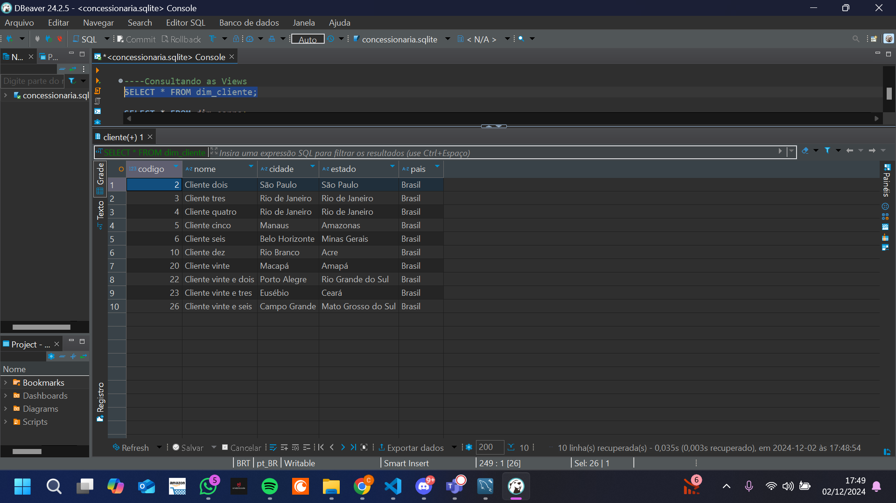

    dim_carro

    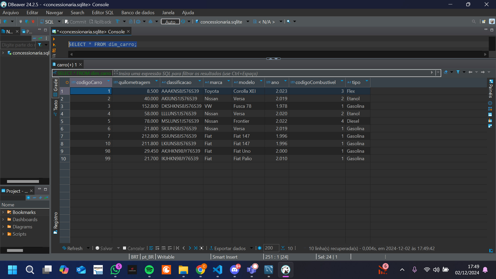

    dim_vendedor

    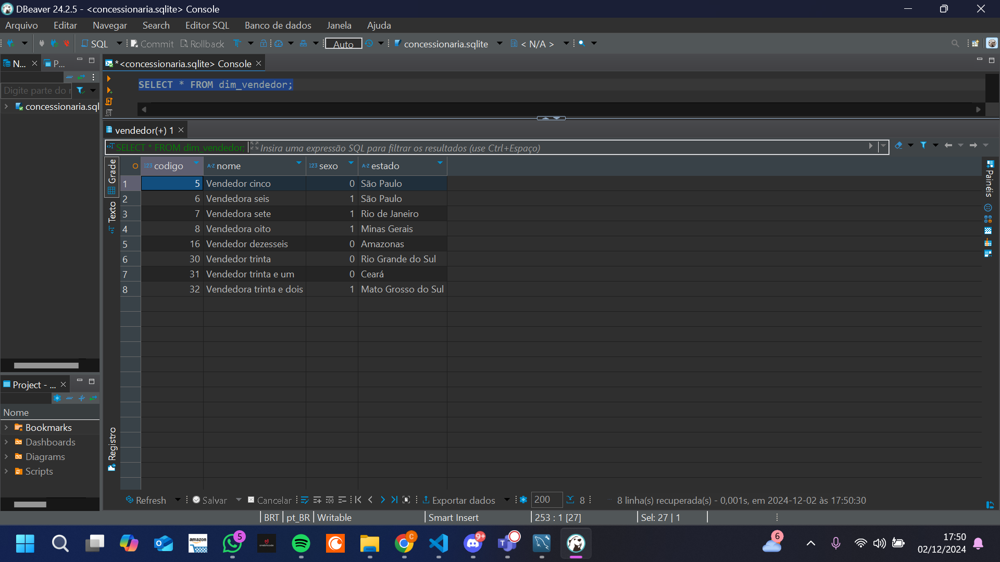

    dim_tempo

    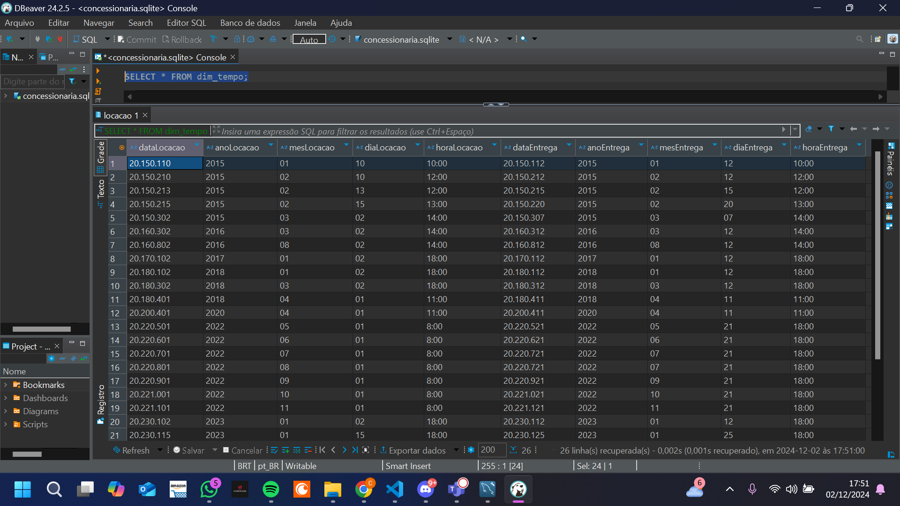

    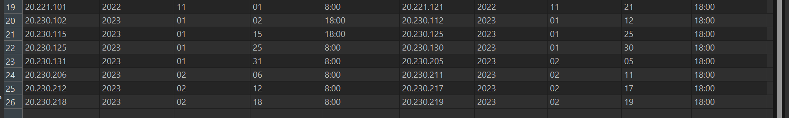

    fato_locacao

    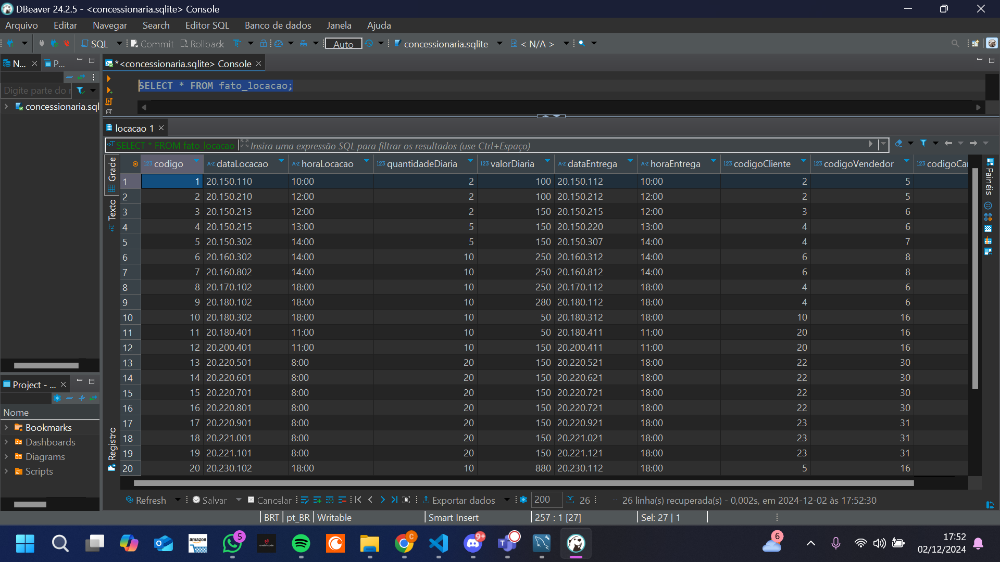
    
    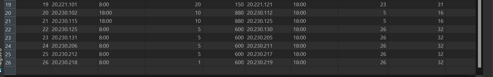


    E aqui está o modelo dimensional: 

    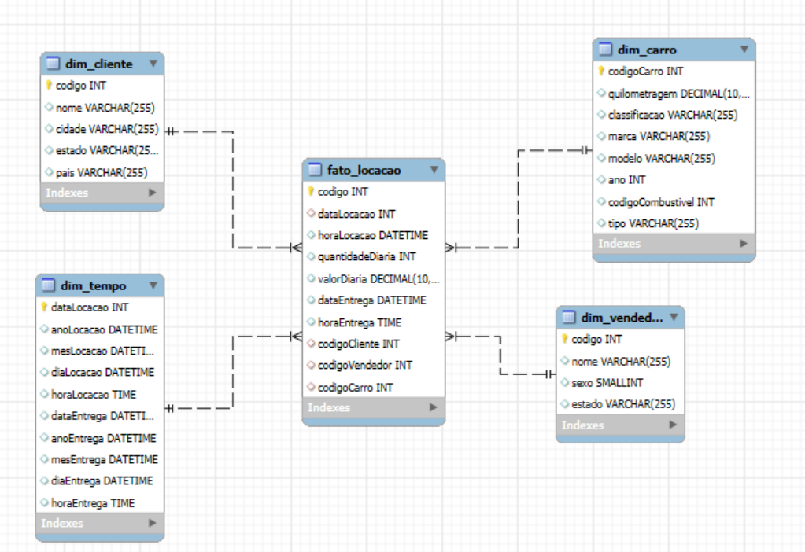