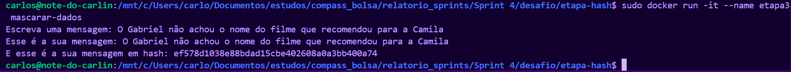

# Etapa 1

    O primeiro passo dessa etapa foi a criação de uma imagem que executasse o arquivo abaixo: 
[carguru.py](carguru.py)

    Para isso utilizei o comando:
``` docker build -t <nome da imagem>``` 
    
    como pode ser visto na evidência abaixo: 


    e aqui pode-se ver que a imagem foi criada:


    Após isso foi necessária a criação e execução de um container a partir desta imagem: 


    E aqui está ele criado:


# Etapa 2

    Pergunta: É possível reutilizar um container ? 
    Resposta: Sim, e aqui está um container sendo reiniciado através do comando:
``` docker start -i <nome do conteiner>```


# Etapa 3

    O primeiro passo dessa etapa foi a criação de um arquivo python que aceitasse uma string, aplicasse o hash nela e a exibisse criptografada, tudo está feito nesse script:
[hash.py](./etapa-hash/hash.py)

    O segundo passo foi a criação de uma imagem para executar esse aquivo:


    e aqui pode-se ver que a imagem foi criada:


    O terceiro e último passo foi a criação e execução do container através dessa imagem:



