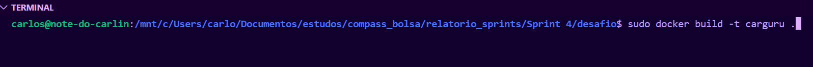
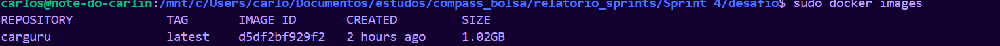
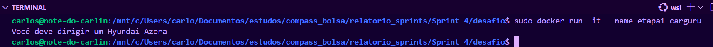
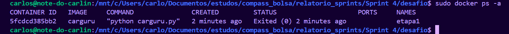
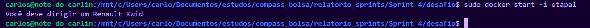
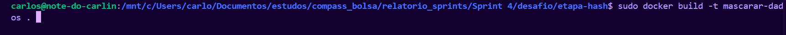
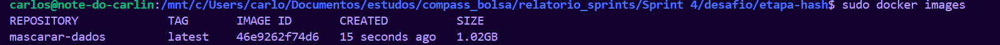
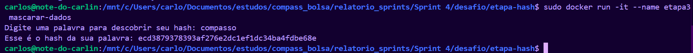
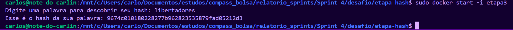

# Etapa 1

O primeiro passo dessa etapa foi a criação de uma imagem que executasse o arquivo abaixo: 
[carguru.py](carguru.py)

Para isso utilizei o comando:
``` docker build -t <nome da imagem> .``` que executou esse aquivo Dockerfile: [Dockerfile-etapa 1](./Dockerfile)
    
Como pode ser visto na evidência abaixo: 



E aqui pode-se ver que a imagem foi criada:



Após isso foi necessária a criação e execução de um container a partir desta imagem: 



E aqui está ele criado:



# Etapa 2

### Pergunta: É possível reutilizar um container ? 
Resposta: Sim, e aqui está um container sendo reiniciado através do comando:
``` docker start -i <nome do container>```




# Etapa 3

### O primeiro passo dessa etapa foi a criação de um arquivo python que aceitasse uma string, aplicasse o hash nela e a exibisse criptografada, como podemos ver abaixo:

```
    import hashlib

    # Input para receber string
    string = input('Digite uma palavra para descobrir seu hash: ')

    # Gera o hash SHA-1
    hash_sha1 = hashlib.sha1(string.encode())

    # Exibe o resultado
    print(f"Esse é o hash da sua palavra: {hash_sha1.hexdigest()}")

```

Onde ```hashlib.sha1()```: Cria um objeto de hash utilizando o algoritmo SHA-1;

```.encode()```: Converte a string em bytes, pois o SHA-1 opera em dados binários e 

```.hexdigest()```: Retorna o hash final como uma string hexadecimal legível.


O arquivo python está aqui: [hash.py](./etapa-hash/hash.py)


### O segundo passo foi a criação de uma imagem para executar esse aquivo:

 

Através do aquivo dockerfile: [Dockerfile-etapa 3](./etapa-hash/Dockerfile)

E aqui pode-se ver que a imagem foi criada:



### O terceiro e último passo foi a criação e execução do container através da respectiva imagem imagem:



E aqui está ele sendo executado mais uma vez:




