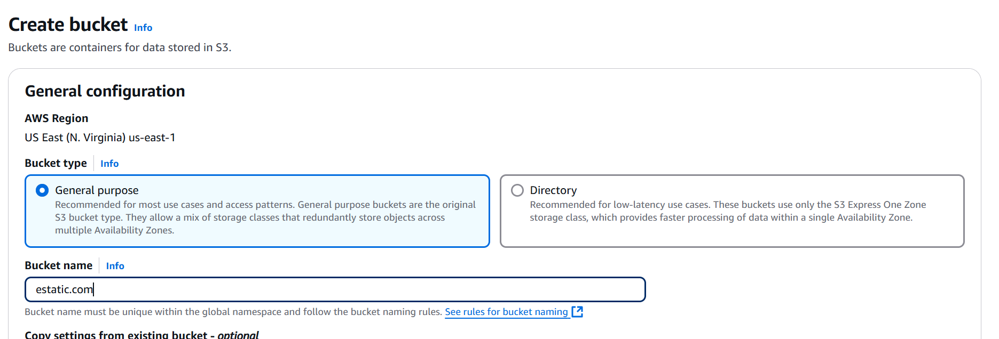
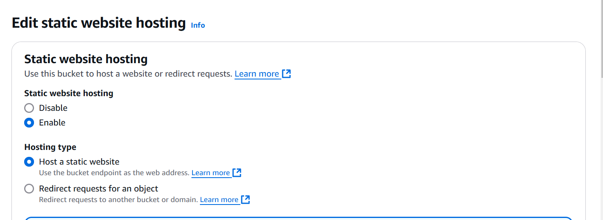
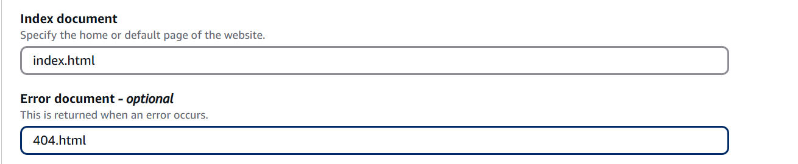
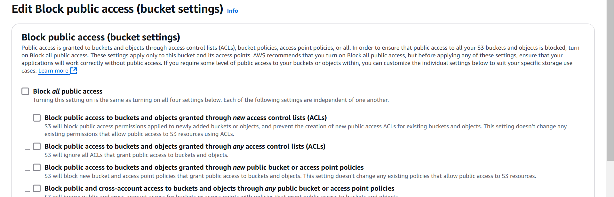
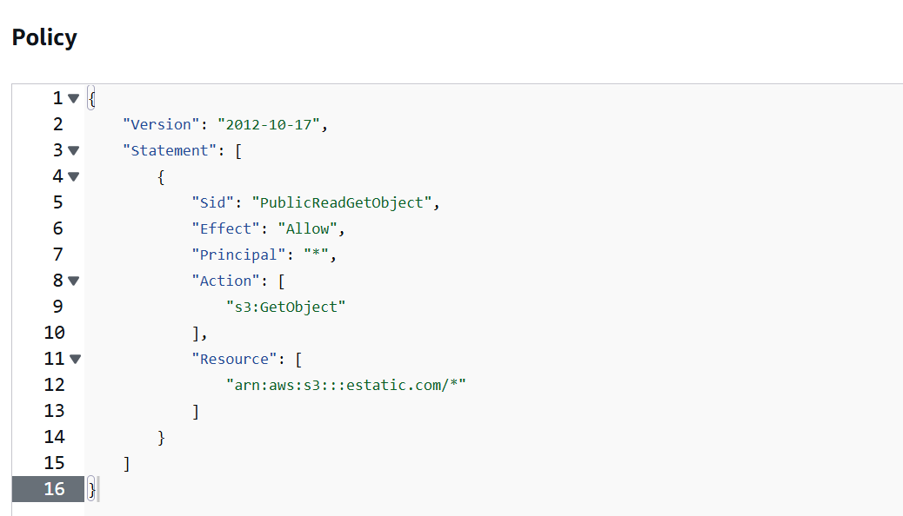
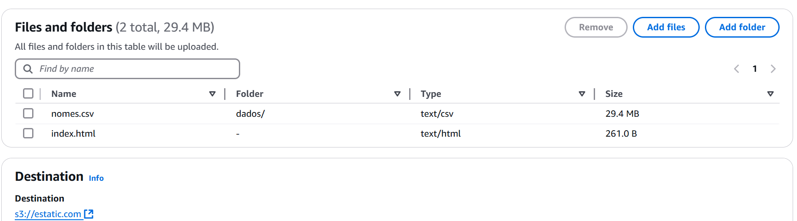
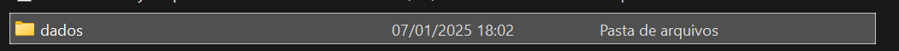
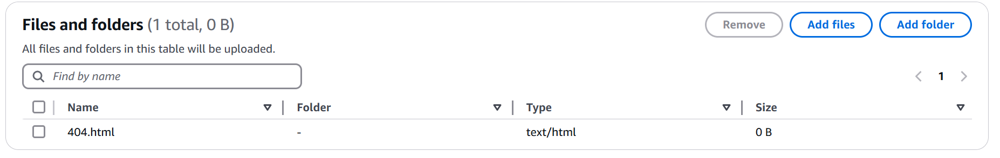
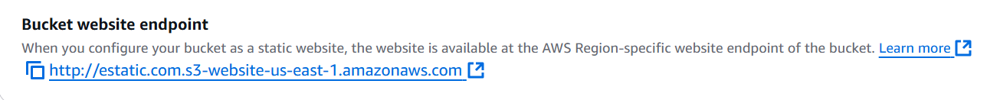
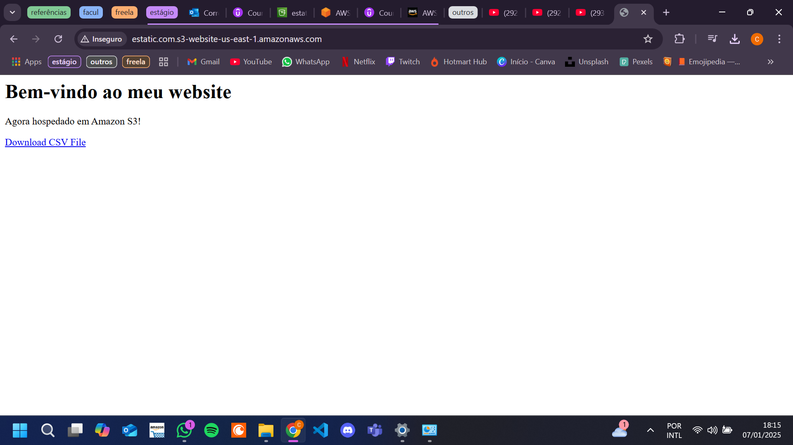

# Resumo

**AWS Cloud Quest:** O jogo da plataforma foi muito bom e intuitivo para aprender na prática os conceitos e serviços.

**AWS Preparatório:** O curso de preparação para a prova foi muito bom pois relembra muitos assuntos e nos ensina a ler e interpretar as questões da prova.

# Exercícios

### Exercício Bucket 

[index.html](exercicios/index.html)

[404.html](exercicios/404.html)

[nomes.csv](exercicios/dados/nomes.csv)

# Evidências

## Etapa 1 : Criar Bucket

## Etapa 2: Habilitar hospedagem de site estático

### habilitando hospedagem

### definindo nome dos arquivos

## Etapa 3: editar as configurações do Bloqueio de acesso público

## Etapa 4: Adicionar política de bucket que torna o conteúdo do bucket publicamente disponível

## Etapa 5: Configurar um documento de índice

### fazendo upload dos arquivos 

### pasta dados

## Etapa 6: configurar documento de erros

### arquivo de erro criado localmente

### upload do arquivo de erro

## Etapa 7: testar o endpoint do site

### endpoint 

### site no ar

# Certificados

[AWS Partner Credenciamento Técnico](./certificados/AWS_Partner_Credenciamento_Técnico_(Carlos_Alberto_Alves_Ribeiro).pdf)
