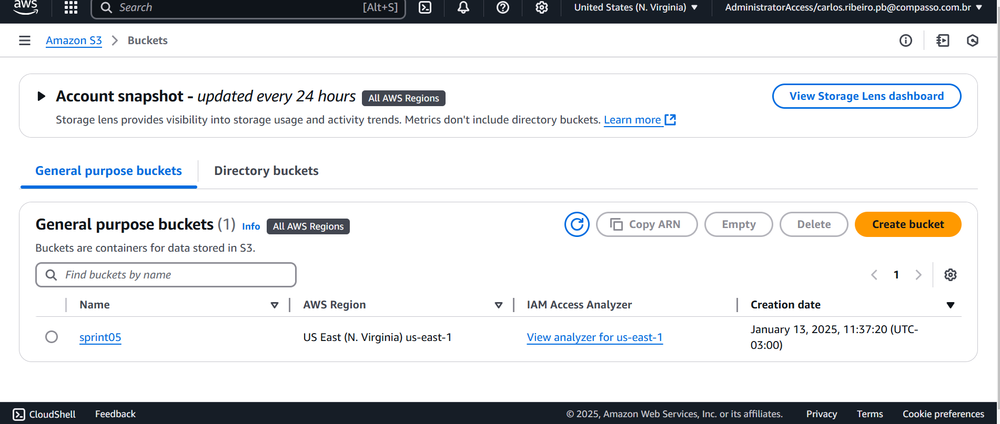
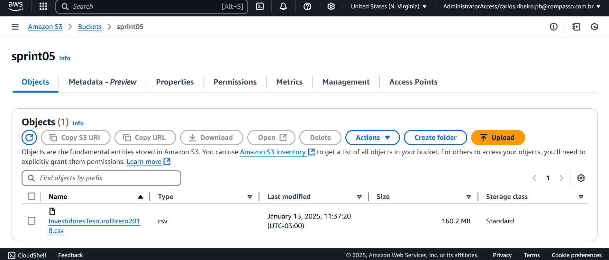
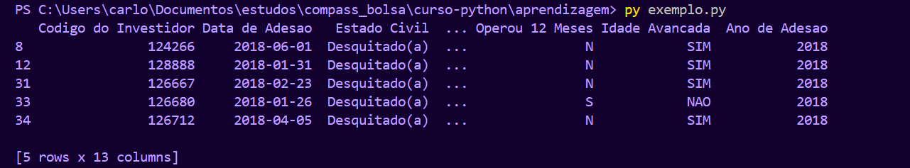
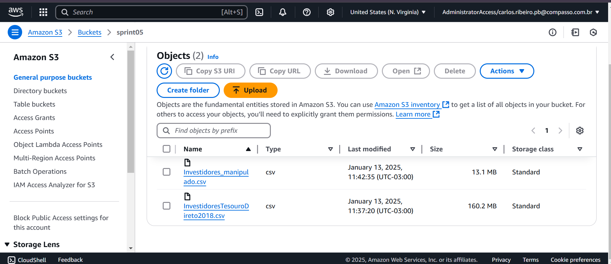

# Etapa inicial - conexão com conta AWS 

### Para isso fiz a configuração do SSO e depois coloquei o token fornecido pelo site na pasta credentials. 


# Etapa 1 - Criar um bucket novo e enviar o dataset escolhido

## Para criação do bucket utilizei o seguinte código presente no arquivo [upload.py](upload.py)
    
```python 

# guardando chamada de funcao em variavel
client = boto3.client('s3')

# criando bucket
client.create_bucket(Bucket = 'sprint05' )

```

## Bucket criado com sucesso : 

## E para envio do arquivo utilizei o seguinte código presente no arquivo [upload.py](upload.py)

```python 

# fazendo upload do arquivo original para o bucket
client.upload_file(Filename = 'InvestidoresTesouroDireto2018.csv',
                   Bucket = 'sprint05',
                   Key = 'InvestidoresTesouroDireto2018.csv')

```

## Arquivo no bucket : 


# Etapa 2 - Baixar o arquivo do bucket e fazer as devidas manipulações 

## Para baixar o arquivo do bucket utilizei o seguinte código presente no arquivo [manipulation.py](manipulation.py) : 

```python 

# guardando chamada de funcao em variavel
client = boto3.client('s3')

# baixando arquivo do bucket
client.download_file(Bucket = 'sprint05', 
                    Key = 'InvestidoresTesouroDireto2018.csv', 
                    Filename = 'BAIXADO-InvestidoresTesouroDireto2018.csv')

```

## Para fazer as manipulações utilizei o seguinte código presente no arquivo [manipulation.py](manipulation.py) : 

```python 
# lendo dataset
df = pd.read_csv('BAIXADO-InvestidoresTesouroDireto2018.csv', delimiter=';')

# corrigindo coluna "Profissao"
df['Profissao'] = df['Profissao'].apply(lambda x: x.split(',') if isinstance(x, str) else x)

# 4.1 - filtragem - filtrando pelas colunas "Estado Civil" e "Genero"
filter = (df['Estado Civil'] == 'Desquitado(a)') & (df['Genero'] == 'F')
df_filtered = df[filter].copy()

# 4.2 - duas funcoes de agregacao (media) e (soma)
avg_age = df_filtered['Idade'].mean()

sum_age = df_filtered['Idade'].sum()

# 4.3 - funcao condicional: usando a media das idades para criar uma coluna nova
df_filtered['Idade Avancada'] = df_filtered['Idade'].apply(lambda x: 'Sim' if x > avg_age else 'Nao')

# 4.4 - funcao de conversao - convertendo inteiro para string
df_filtered['Codigo do Investidor'] = df_filtered['Codigo do Investidor'].astype(str)

# 4.5 - funcao de data - passando a data para formato padrao e utilizando o ano para criar uma nova coluna
df_filtered['Data de Adesao'] = pd.to_datetime(df_filtered['Data de Adesao'], dayfirst= True)
df_filtered['Ano de Adesao'] = df_filtered['Data de Adesao'].dt.year

# 4.6 - funcao de string - passando a coluna para letras maiusculas
df_filtered['Idade Avancada'] = df_filtered['Idade Avancada'].str.upper()

# criando novo arquivo csv a partir do dataframe atualizado
df_filtered.to_csv('Investidores_manipulado.csv', index= False)

print(df_filtered.head())

```

# Etapa 3 - Enviar o arquivo manipulado para o bucket 

## Para enviar o arquivo utilizei o seguinte código presente no arquivo [manipulation.py](manipulation.py) :

```python 

# fazendo upload do arquivo novo para nuvem
client.upload_file(Filename = 'Investidores_manipulado.csv',
                   Bucket = 'sprint05',
                   Key = 'Investidores_manipulado.csv')

```

## Código executado 

## Arquivo no bucket : 