# Resumo

**AWS Cloud Quest:** O jogo da plataforma foi muito bom e intuitivo para aprender na prática os conceitos e serviços.

**AWS Preparatório:** O curso de preparação para a prova foi muito bom pois relembra muitos assuntos e nos ensina a ler e interpretar as questões da prova.

# Exercícios

### Exercício 3 - Lab AWS Athena

[resultado](exercicios/athena/3-etapa_3.5-resultado.csv)

- [Exercício 3 - evidências](#exercício-3---lab-aws-athena-1)

### Exercício 4 - Lab AWS Lambda

[dockerfile](exercicios/lambda/dockerfile)

[minha-camada-pandas.zip](exercicios/lambda/minha-camada-pandas.zip)

- [Exercício 4 - evidências](#exercício-4---lab-aws-lambda-1)


# Evidências

## Exercício 3 - Lab AWS Athena

## Etapa 1: Configurar Athena
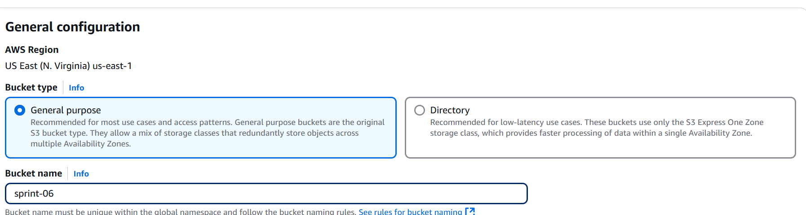

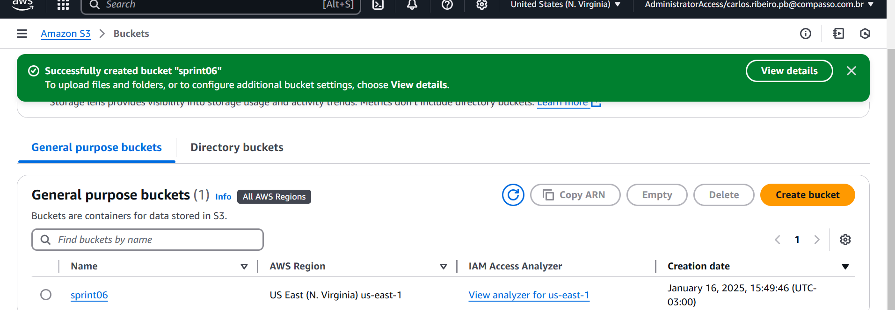

### upload csv
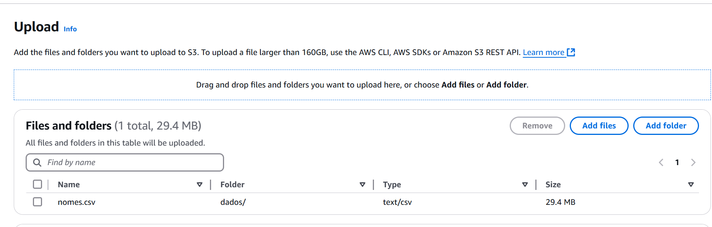

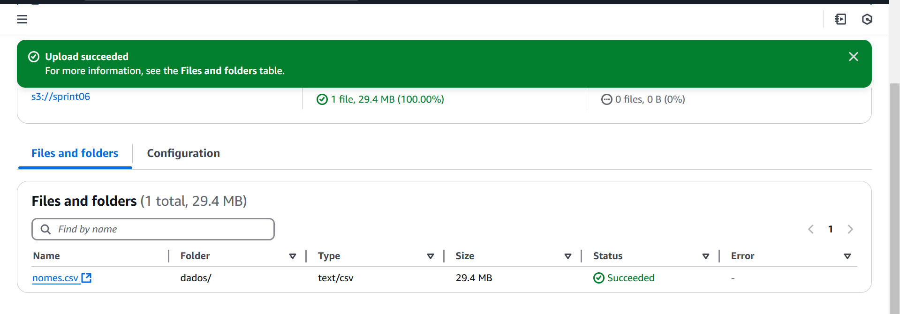

### pasta queries
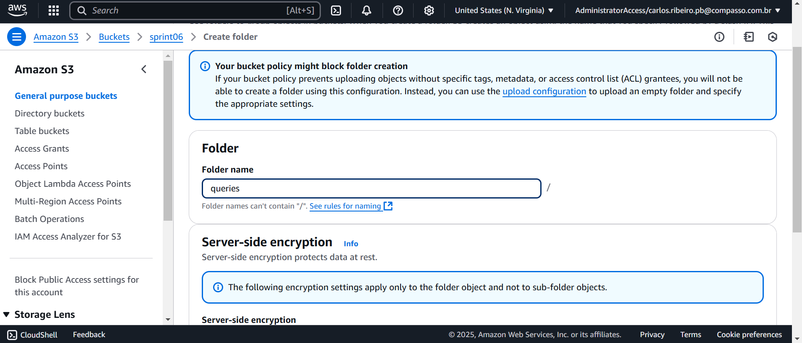

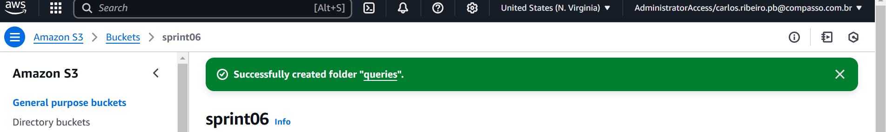

### caminho para o bucket
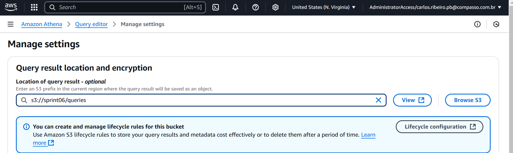


## Etapa 2: Criar um banco de dados
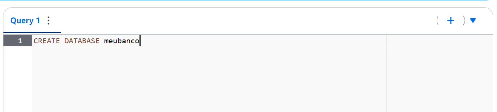


## Etapa 3: Criar uma tabela

### criar tabela 
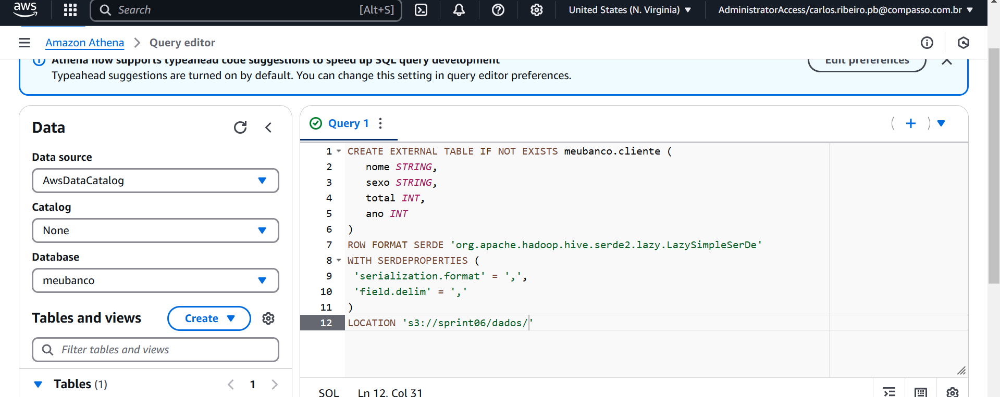

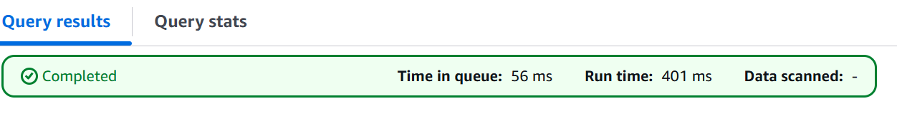

### testando dados
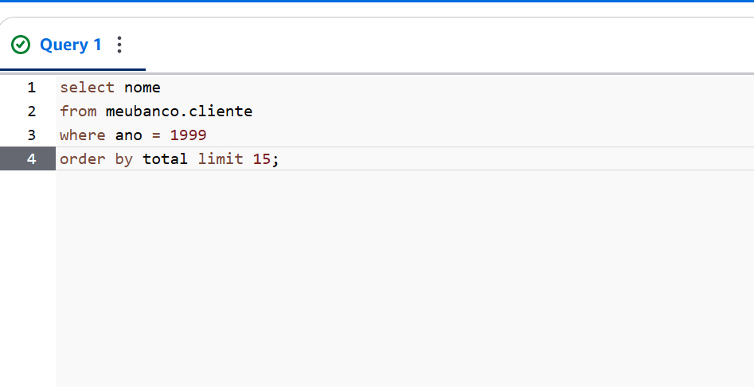

### resultado
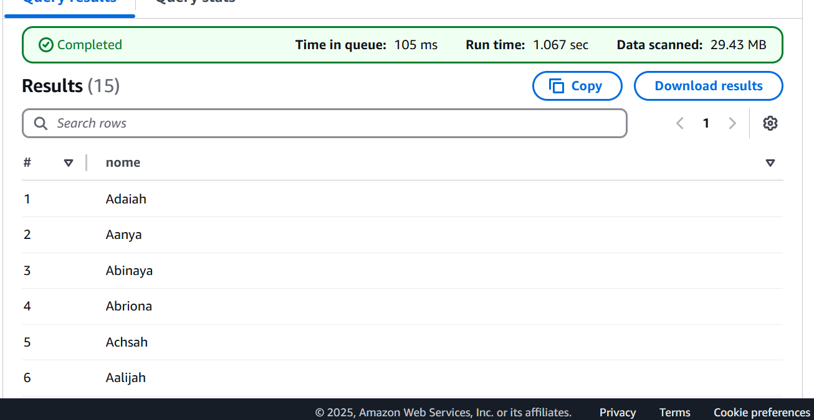

### consulta que lista os 3 nomes mais usados em cada década desde o 1950 até hoje.
``` sql
WITH decadas AS (
    SELECT 
        CAST(FLOOR(ano / 10) * 10 AS INTEGER) AS decada,
        nome,
        SUM(total) AS total_frequencia
    FROM cliente
    WHERE ano >= 1950
    GROUP BY CAST(FLOOR(ano / 10) * 10 AS INTEGER), nome
),
nomes_ranqueados AS (
    SELECT
        decada,
        nome,
        total_frequencia,
        ROW_NUMBER() OVER (PARTITION BY decada ORDER BY total_frequencia DESC) AS rank
    FROM decadas
)
SELECT
    decada,
    nome,
    total_frequencia
FROM nomes_ranqueados
WHERE rank <= 3
ORDER BY decada, rank;

```
### resultado: [query_final](exercicios/athena/3-etapa_3.5-resultado.csv)


## Exercício 4 - Lab AWS Lambda

## Etapa 1: Criar a função do Lambda
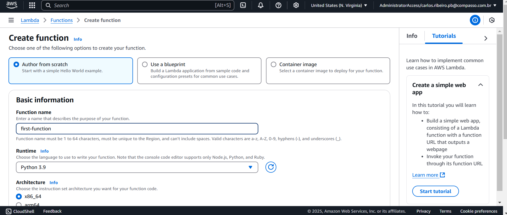


## Etapa 2: Construir o código

### criando teste
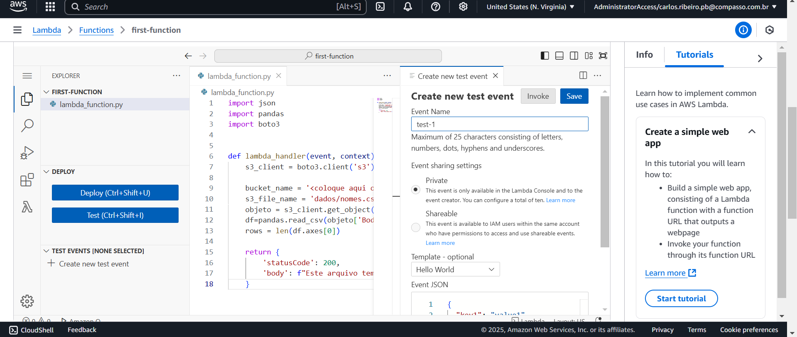

### erro
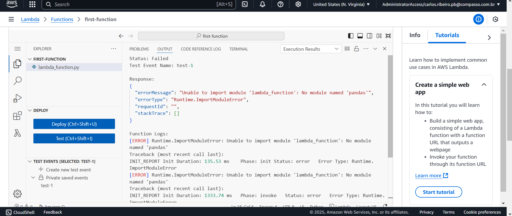


## Etapa3: Criar uma Layer

### dockerfile 
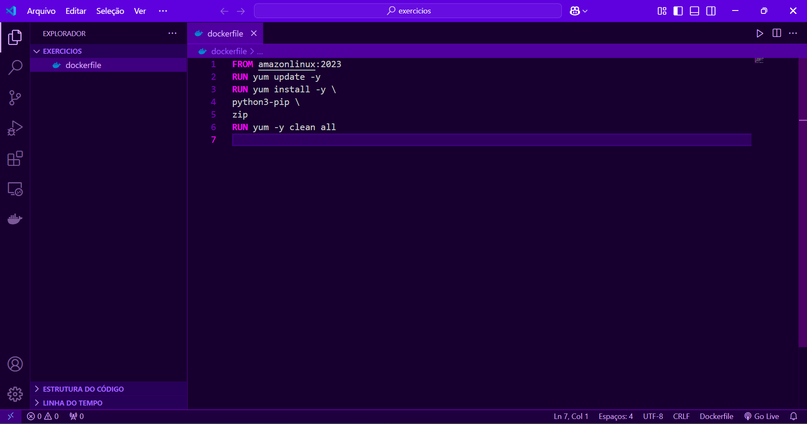

### imagem criada
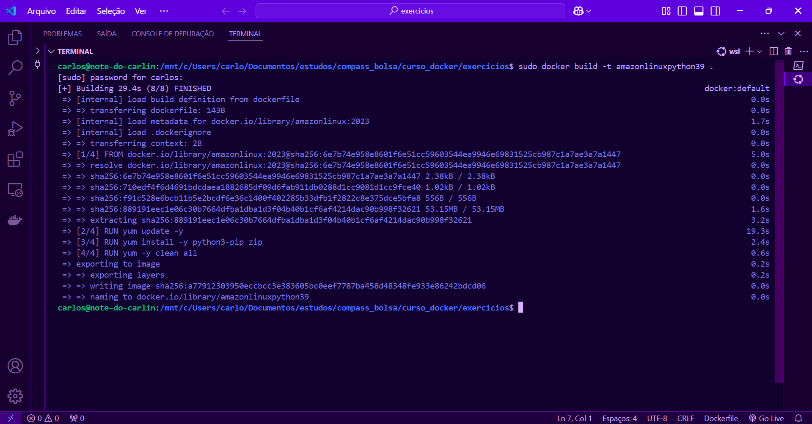

### diretorios criados
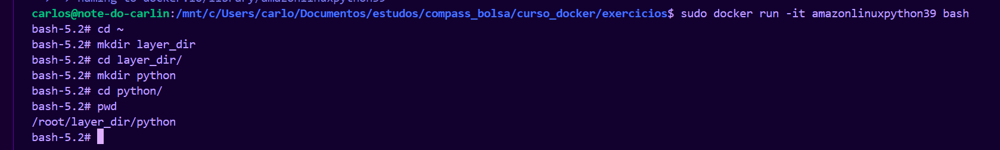

### baixando bibliotecas
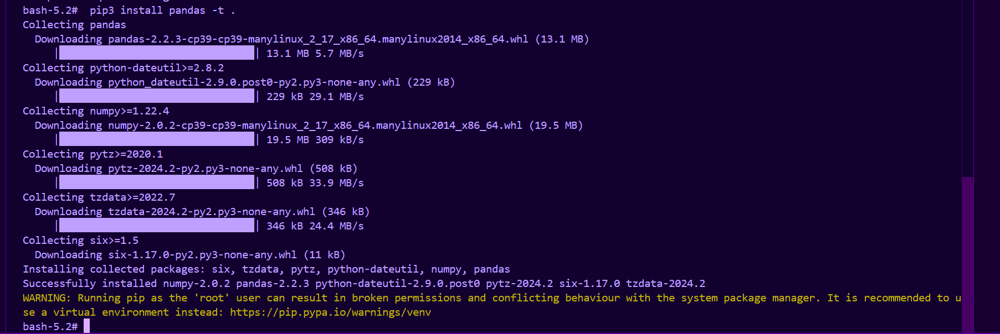

### arquivos compactados
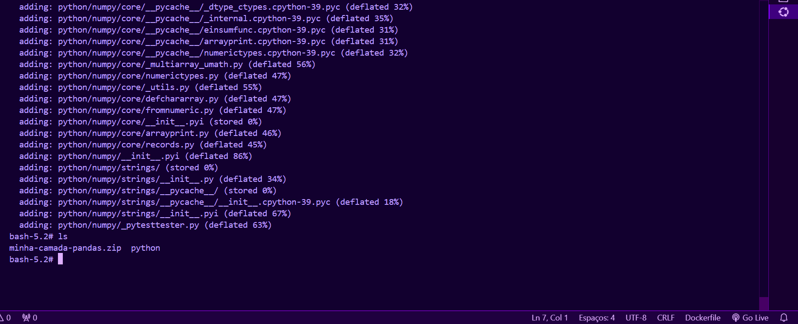

### copiar o zip do Container para a máquina local
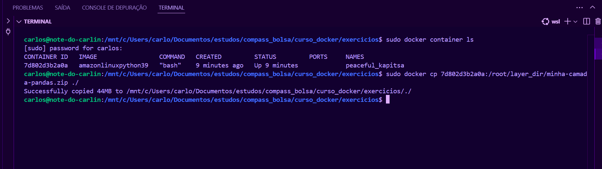

### upload para o bucket
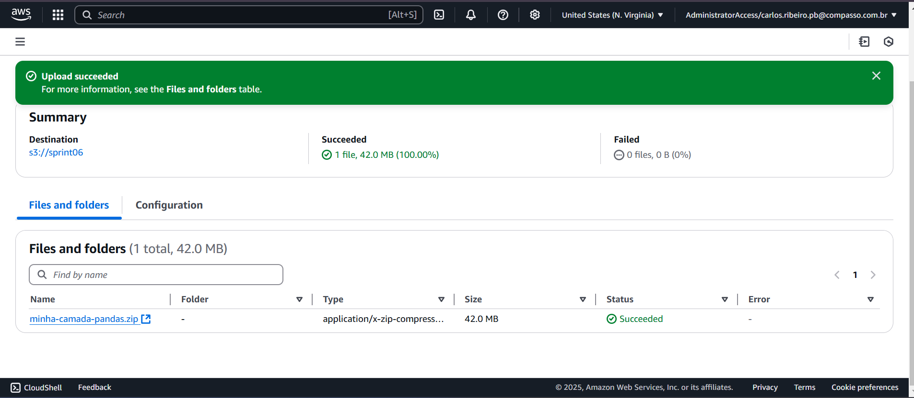

### criando camada 
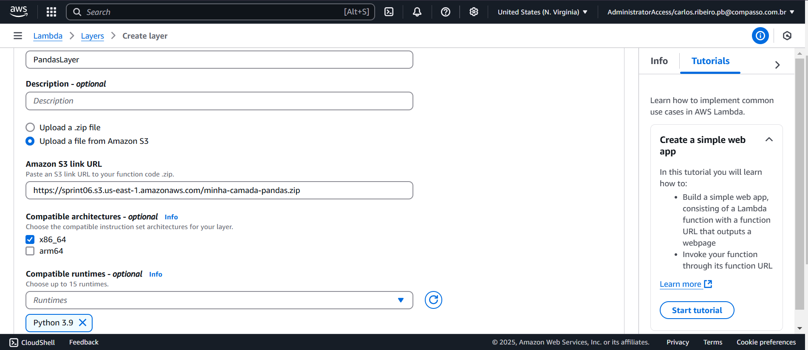


## Etapa 4: Utilizando a Layer

### adicionando camada
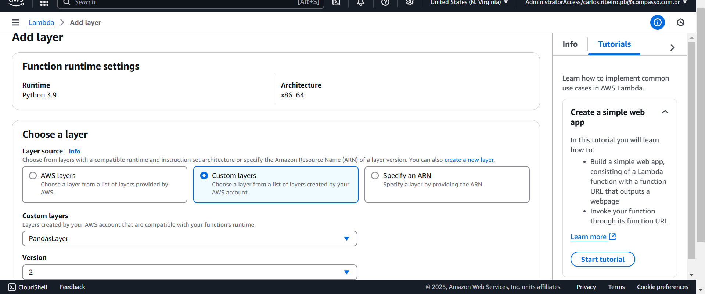

### execução
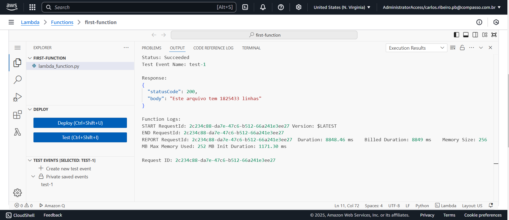


# Certificados

[AWS Skill Builder](./certificados/18719_5_6675764_1736804772_AWS%20Skill%20Builder%20Course%20Completion%20Certificate.pdf)

[AWS Cloud Quest](https://www.credly.com/badges/e107cd36-0ba2-451d-9efc-48d5c1341ae0/public_url)
