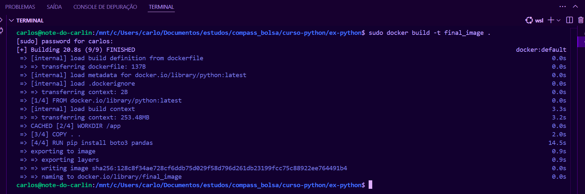
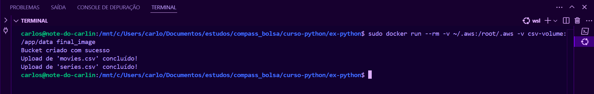
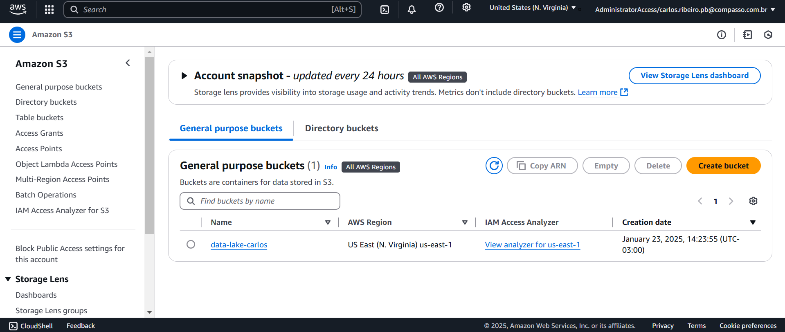
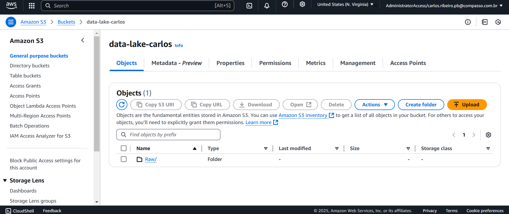
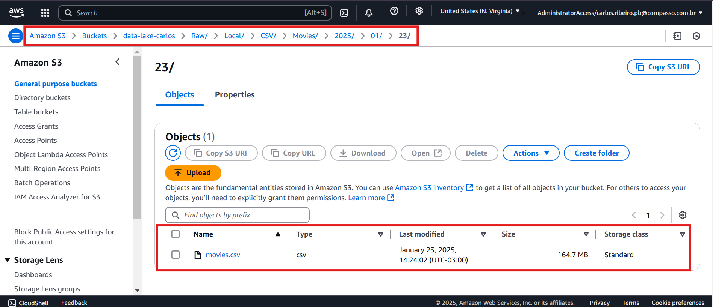
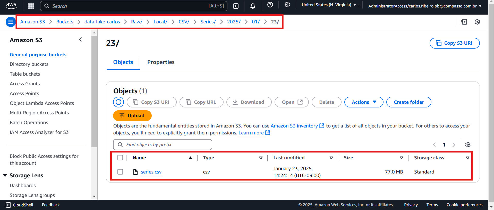
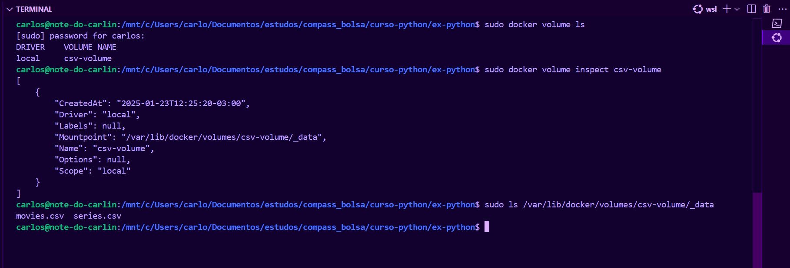

# Perguntas para serem analisadas:
    Quais filmes de guerra tiveram a melhor performance nos últimos 10 anos ?
    Quais gêneros de guerra que fizeram mais sucesso nos últimos 5 anos ?   

# Etapa 1 - Implementar código python para ler os dois arquivos, sem filtragens, e colocá-los no bucket s3: [raw.py](raw.py)

## Para leitura dos arquivos utilizei das seguintes linhas: 

```python 

# diretório onde os arquivos estarão no container
data_dir = "./data"

# lendo os datasets
df_m = pd.read_csv(f"{data_dir}/movies.csv", sep='|', dtype={3: str})
df_s = pd.read_csv(f"{data_dir}/series.csv", sep='|', dtype={3: str})

```


## Para criação do bucket utilizei o seguinte código presente no arquivo [raw.py](raw.py) :
    
```python 

# guardando chamada de funcao em variavel
client = boto3.client('s3')

# criando bucket
try:
    client.create_bucket(Bucket = 'data-lake-carlos' )
    print ("Bucket criado com sucesso")
except Exception as e:
    print (f"Erro ao criar bucket: {e}")

```


## Para salvar os arquivos com a data conforme é pedido importei o módulo datetime e usei esses códigos:

```python 

# data para estruturar o caminho no S3
current_date = datetime.now()
year = current_date.strftime("%Y")
month = current_date.strftime("%m")
day = current_date.strftime("%d")

```


## E para fazer o envio dos arquivos com toda a estrutura de pastas como é pedido, ficou dessa maneira:  

```python 

# fazendo upload dos arquivos para nuvem
bucket_name = "data-lake-carlos"

try:
    client.upload_file(
        Filename=f"{data_dir}/movies.csv",
        Bucket=bucket_name,
        Key=f"Raw/Local/CSV/Movies/{year}/{month}/{day}/movies.csv"
    )
    print("Upload de 'movies.csv' concluído!")
except Exception as e:
    print(f"Erro ao fazer upload de 'movies.csv': {e}")

try:
    client.upload_file(
        Filename=f"{data_dir}/series.csv",
        Bucket=bucket_name,
        Key=f"Raw/Local/CSV/Series/{year}/{month}/{day}/series.csv"
    )
    print("Upload de 'series.csv' concluído!")
except Exception as e:
    print(f"Erro ao fazer upload de 'series.csv': {e}")

```


# Etapa 2 - Criar container Docker com um volume para armazenar os arquivos e executar o script python

## Para isso eu estruturei o arquivo [dockerfile](dockerfile) da seguinte maneira : 

```dockerfile 

FROM python

WORKDIR /app

COPY . .

RUN pip install boto3 pandas

CMD ["python", "raw.py"]


```


### Onde eu copio todos os arquivos, incluindo o diretório onde estão os CSVs, para dentro da imagem para assim quando eu criar o volume junto do container, no diretório '/app/data', o volume "herdar" todos os arquivos que estiverem dentro do respectivo diretório, assim armazenando os arquivos no volume. 


## Aqui está a imagem sendo construída através do comando ``` sudo docker build -t final_image . ``` 




## E então o container sendo iniciado juntamente do volume e executando o script python a partir do código ``` sudo docker run --rm -v ~/.aws:/root/.aws -v csv-volume:/app/data final_image ```
    OBS: foi preciso colocar o caminho até a pasta "credentials" da aws para o wsl poder encontar as credenciais e se conectar a conta aws

## Código sendo executado:




## Data Lake criado com sucesso: 




## Camada Raw: 




## Movies dentro do diretório como é pedido: 




## Series dentro do diretório como é pedido: 



## Arquivos armazenados no volume: 



