# Resumo

**Spark :** O curso de Spark ensinou o necesário desde o básico ao avançado para utilização do framework.

# Exercícios

## Exercício 5 - Spark

[script](exercicios/5-Spark/script.py)

- [Exercício 5 - evidências](#exercício-5---spark-1)

## Exercício 6 - TMDB

[script](exercicios/6-TMDB/tmdb.py)

- [Exercício 6 - evidências](#exercício-4---lab-aws-lambda-1)

## Exercício 7 - Lab Glue

[script](exercicios/7-Glue/glue.py)

- [Exercício 7 - evidências](#exercício-4---lab-aws-lambda-1)

# Evidências

## Exercício 5 - Spark

### Etapa 1: Pull imagem

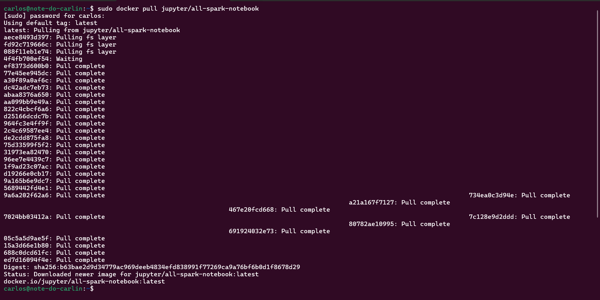

### Etapa 2: Criar container a partir da imagem

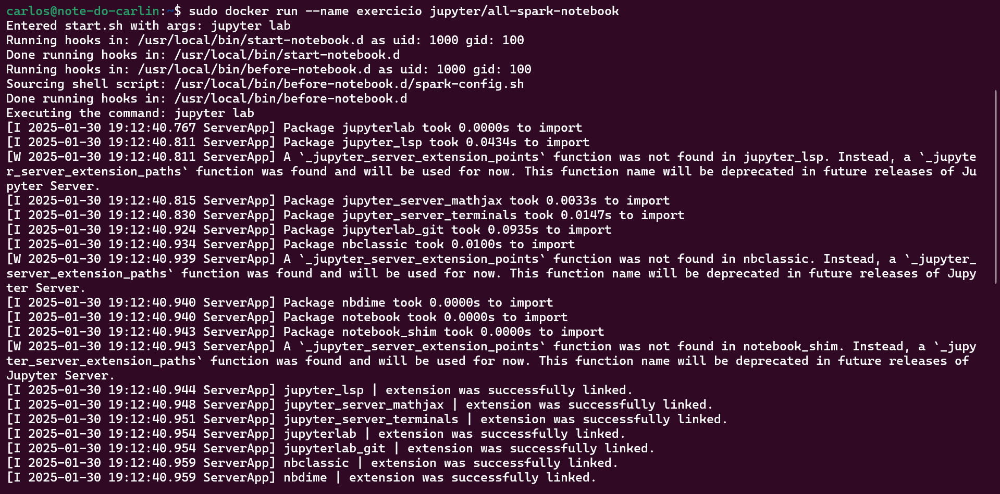

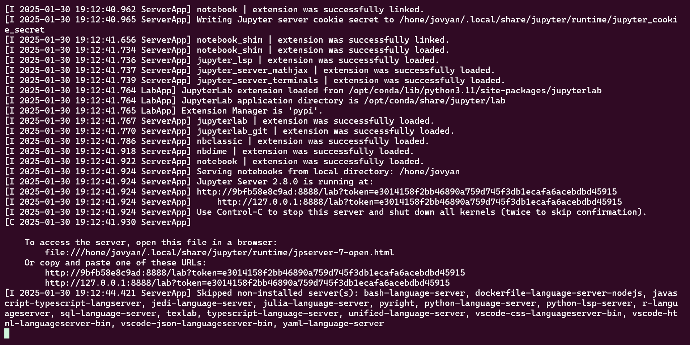

### Etapa 3: PySpark iterativo

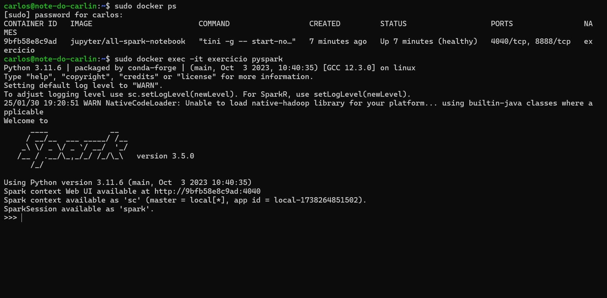

### Etapa 4: Código

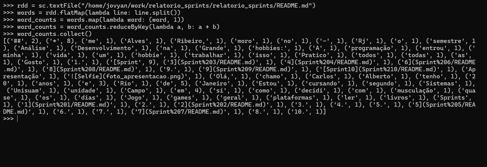

## Exercício 6 - TMDB

### Etapa 1: Criar conta

### Etapa 2: Testar credenciais

## Exercício 7 - Lab Glue

### Etapa 1: Criando a IAM Role para os jobs do AWS Glue

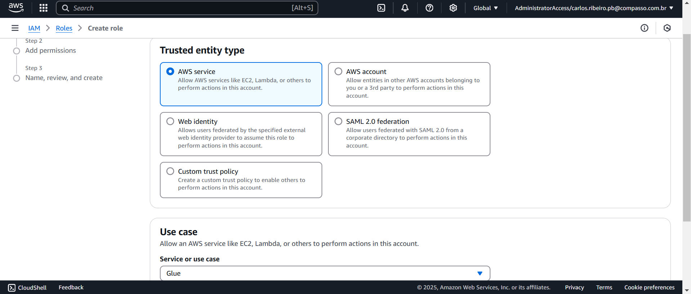

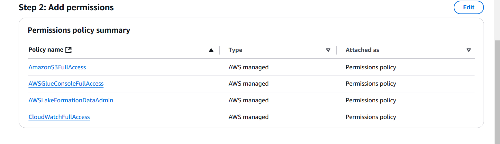

### Etapa 2:  Configurando sua conta para utilizar o AWS Glue

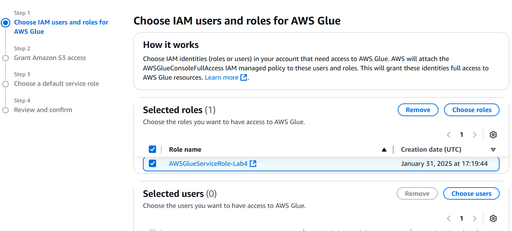

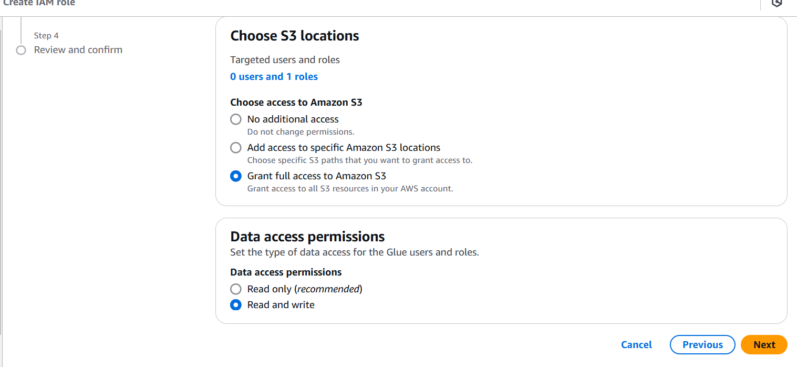

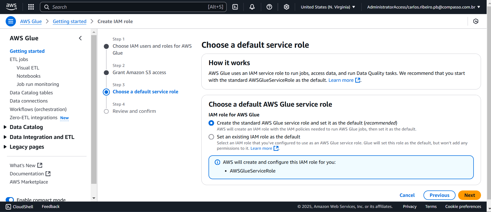

### Etapa 3:  Configurando as permissões no AWS Lake Formation

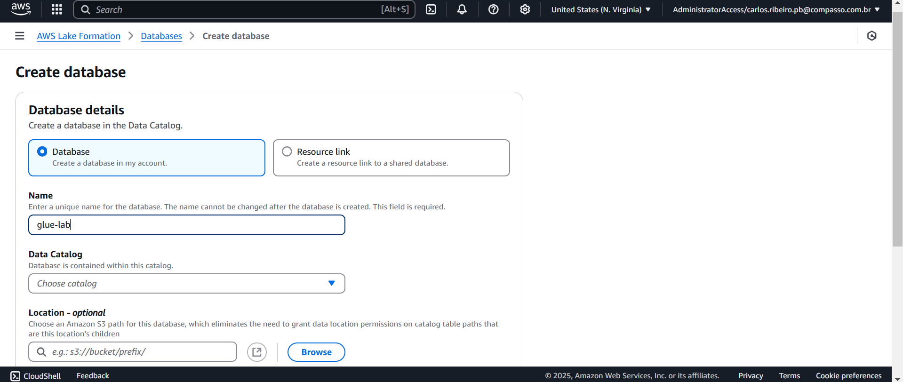

### Etapa 4: - Criando novo job no AWS Glue

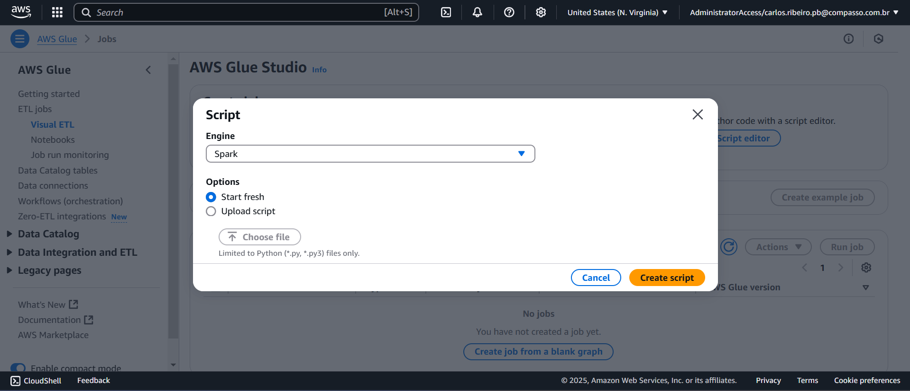

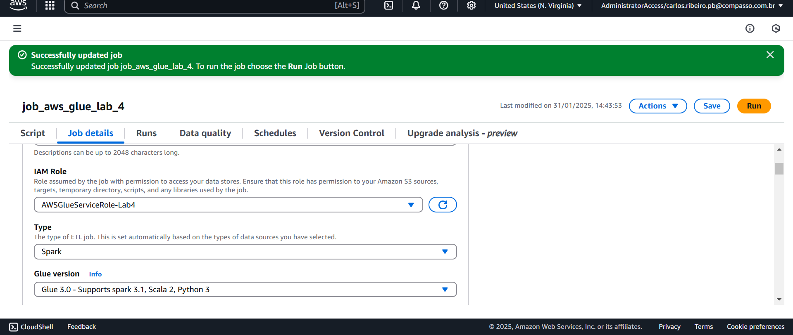

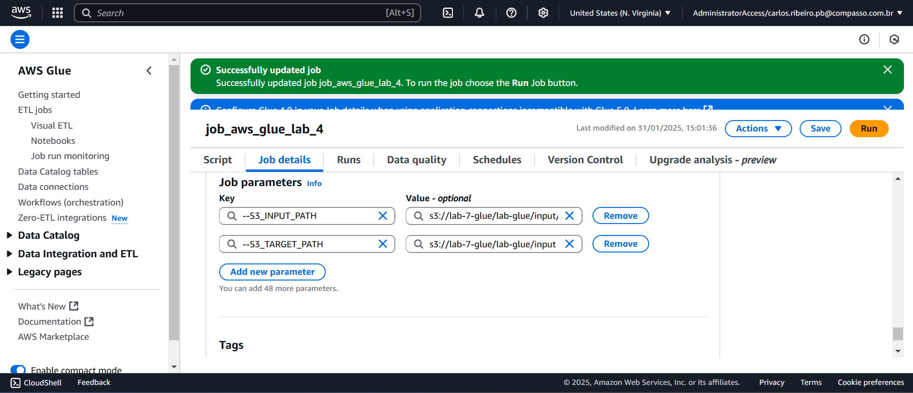

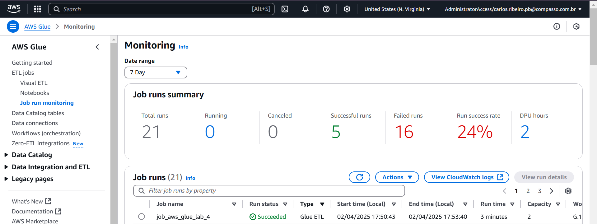

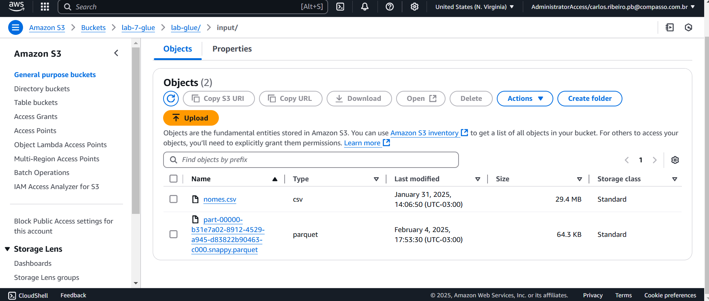

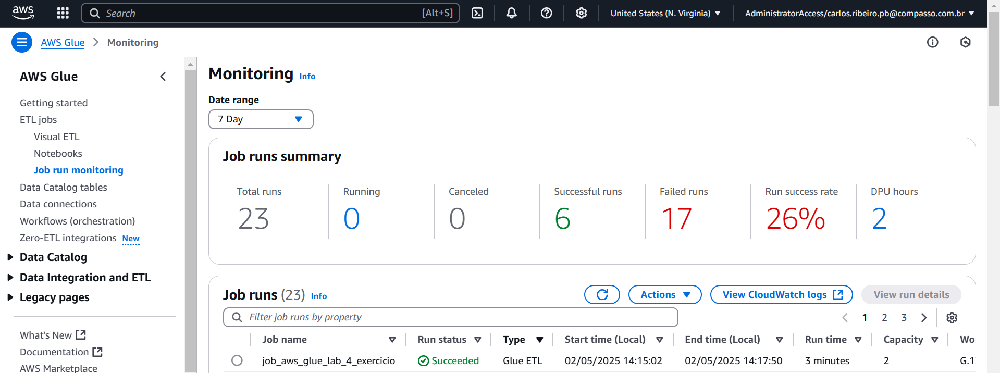

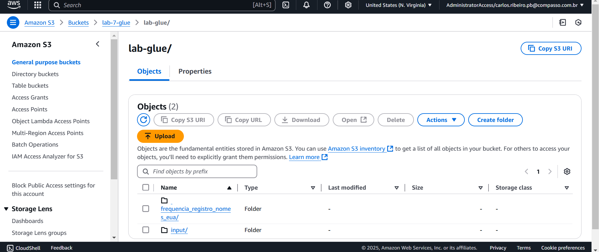

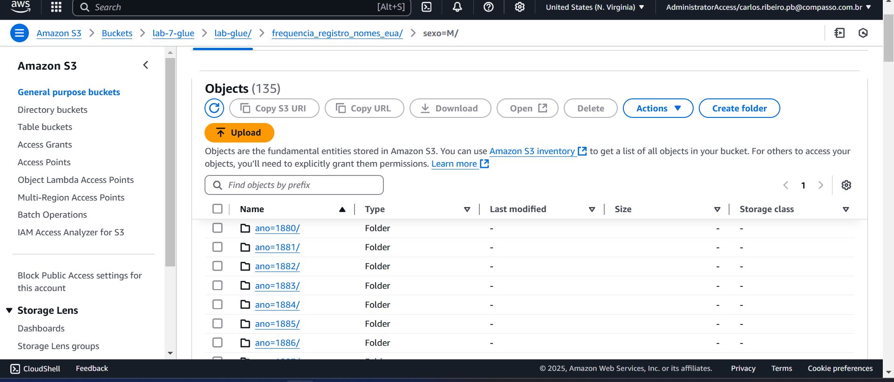

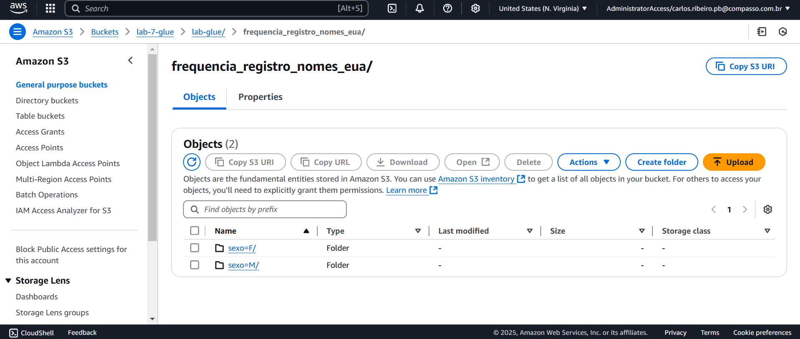

### Etapa 5:  Criando crawler

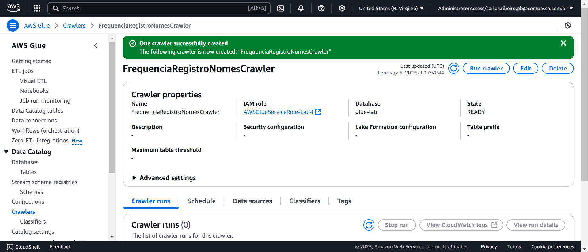

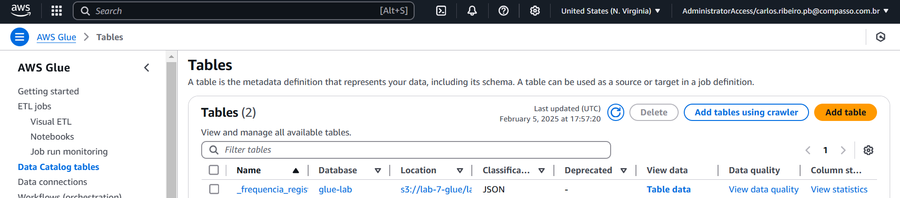

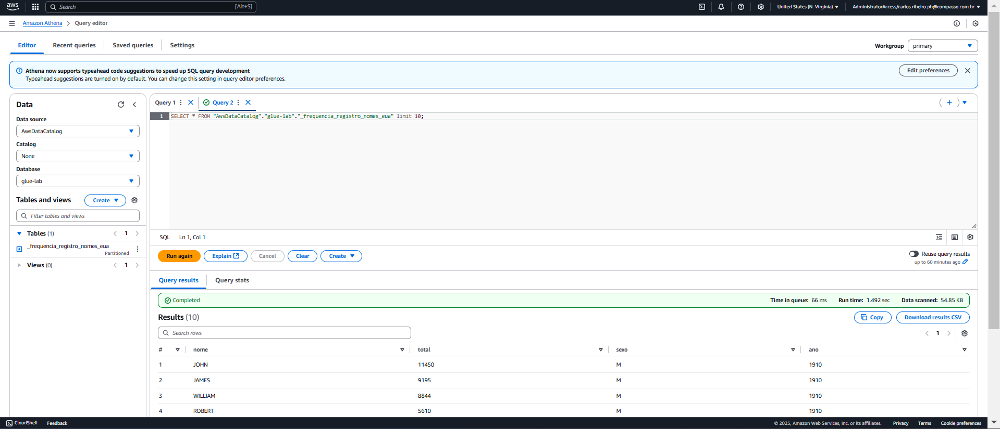

# Certificados

    Não houveram certificados extra Udemy essa Sprint.