# Resumo

**Sprint mais leve quanto a conteúdo e mais puxada quanto a prática, pois precisei refazer os passos da sprint passada**

# Exercícios

## Exercício 2 - Geração em massa

[script](exercicios/2-Geracao_em_massa/nomes_aleatorios.py)

- [Exercício 2 - evidências](#exercício-2---geração-em-massa-1)

### Warmup 
[animal.py](./exercicios/2-Geracao_em_massa/warmup/animal.py)

[num_random.py](./exercicios/2-Geracao_em_massa/warmup/num_random.py)

## Exercício 3 - Apache Spark

[nomes aleatorios](exercicios/3-Apache_Spark/nomes_aleatorios.txt)

- [Exercício 3 - evidências](#exercício-3---apache-spark-1)

## Exercício 5 - TMDB

[script](exercicios/5-TMDB/tmdb.py)

- [Exercício 5 - evidências](#exercício-5---tmdb-1)

# Evidências

## Exercício 2 - Geração em Massa

### Etapa 1: 

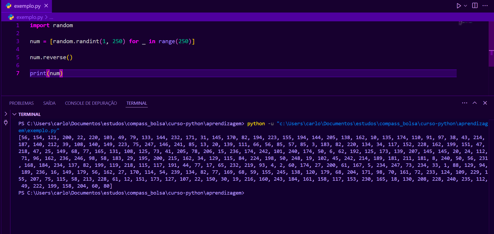

### Etapa 2:

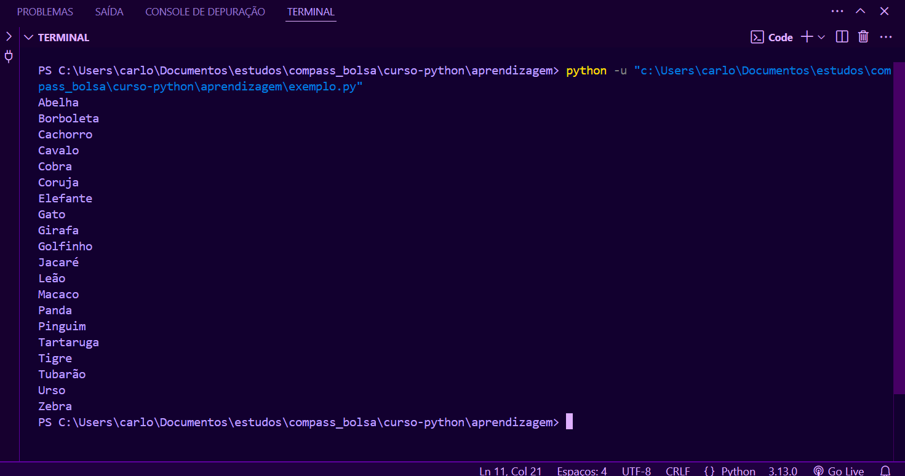

### Etapa 3: 

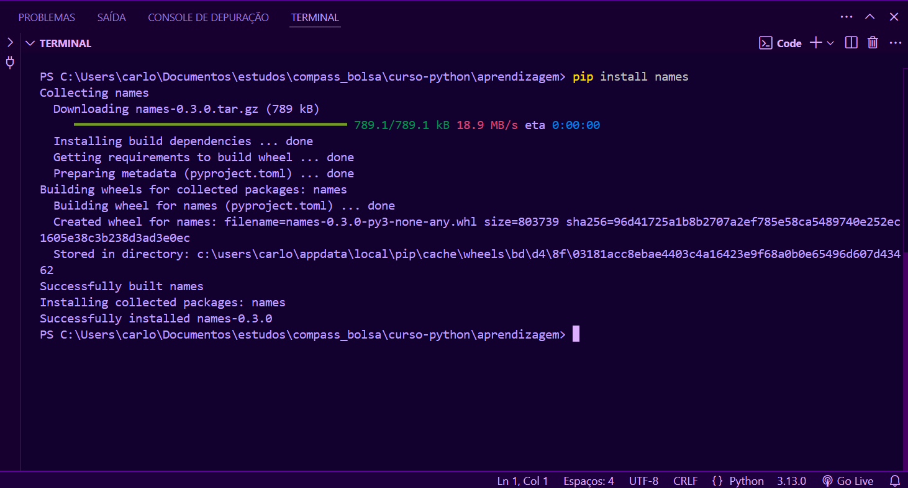

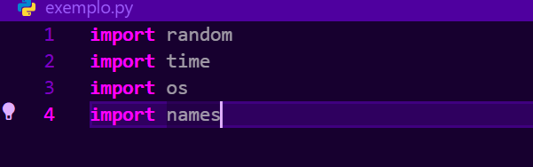

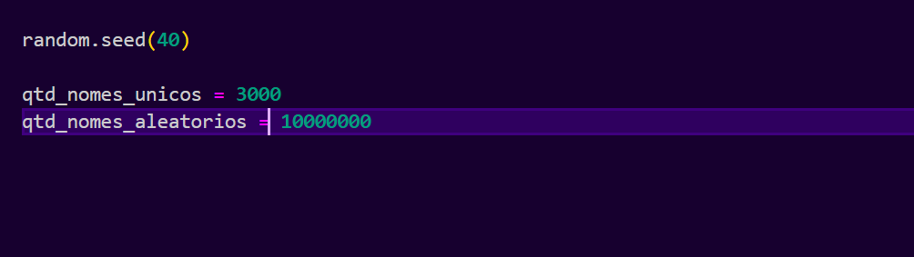

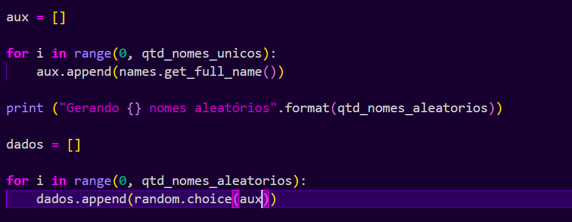

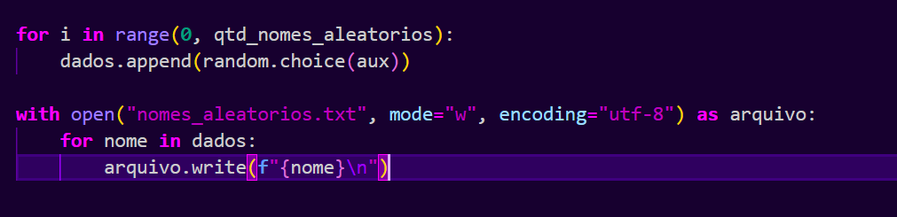

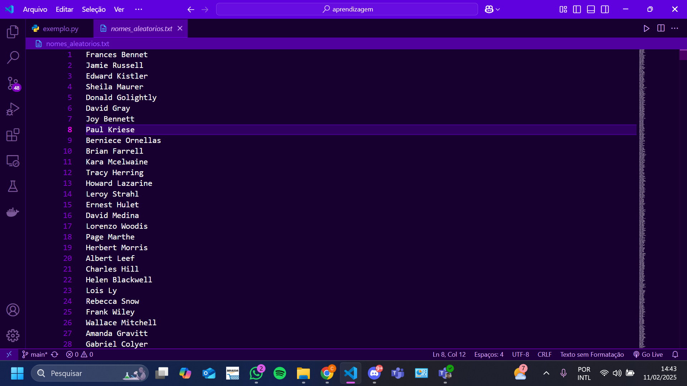

### Etapa 4:

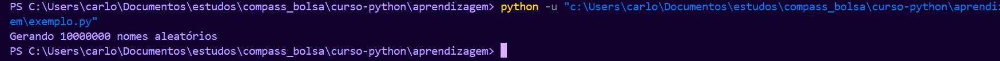

## Exercício 3 - Apache Spark

### Etapa 1

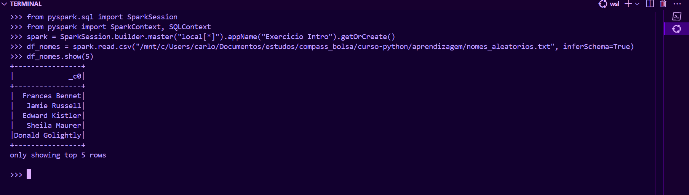

### Etapa 2

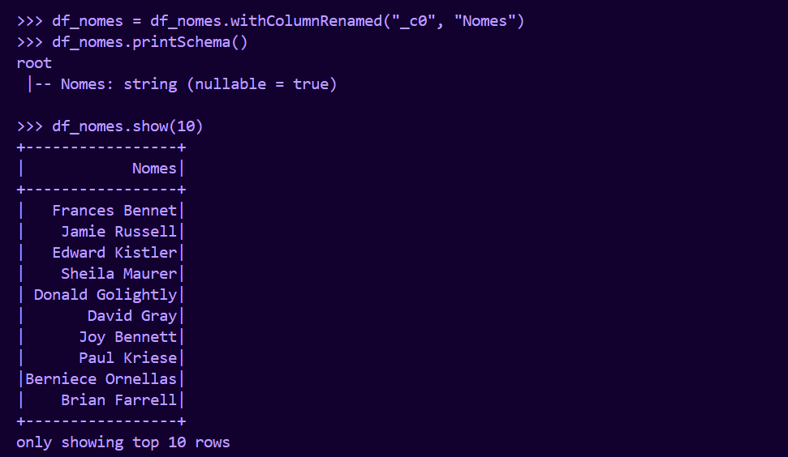

### Etapa 3

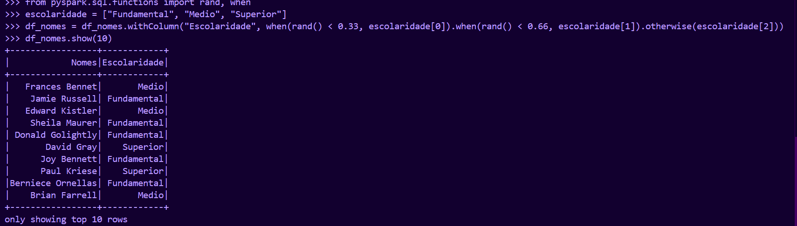

### Etapa 4

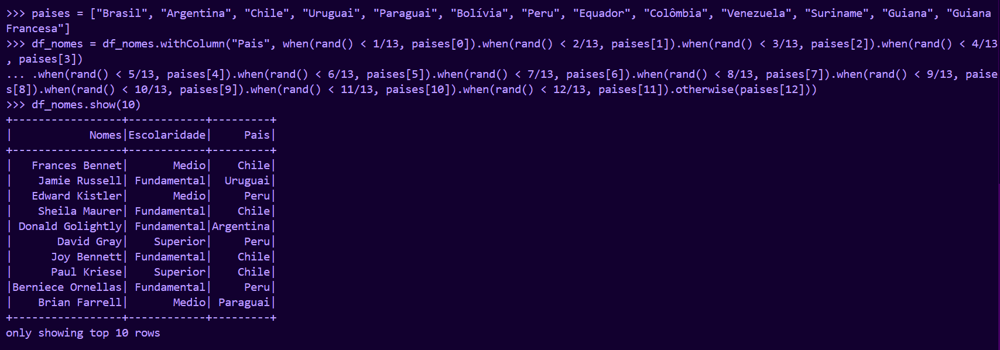

### Etapa 5

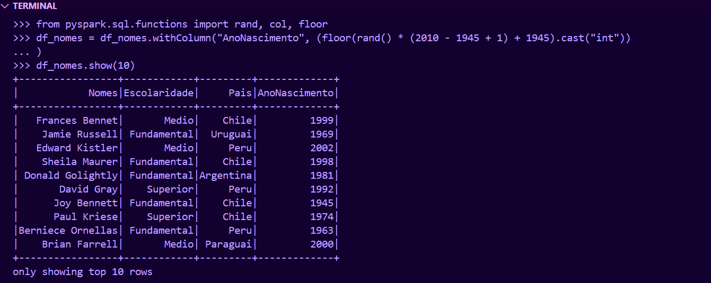

### Etapa 6

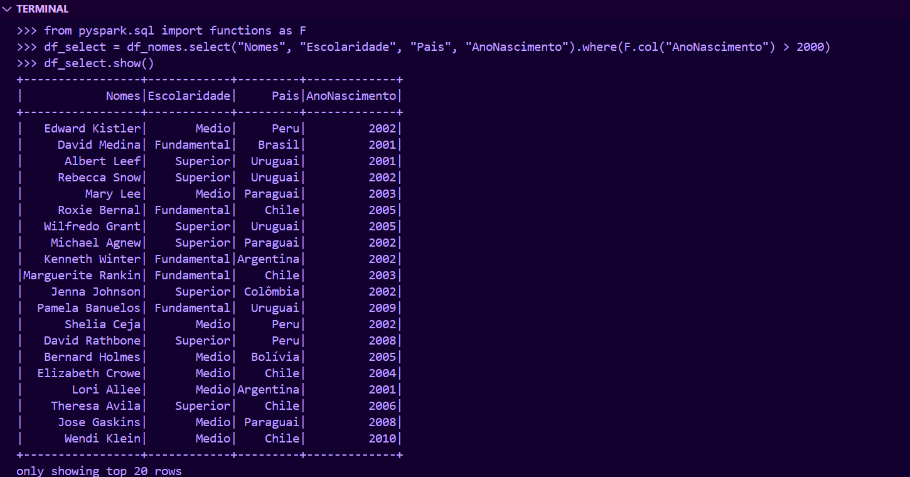

### Etapa 7

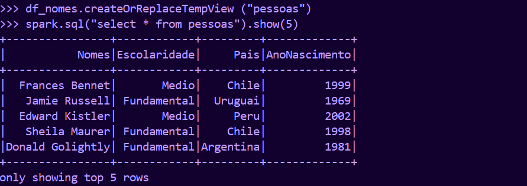

### Etapa 8

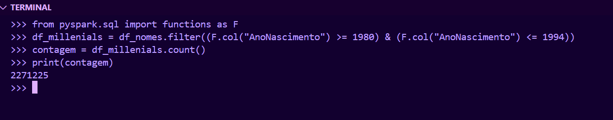

### Etapa 9

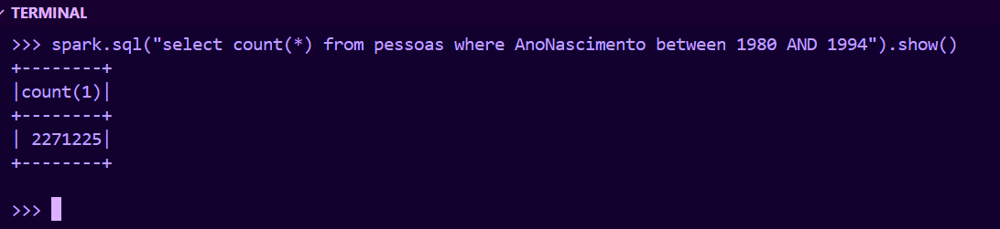

### Etapa 10

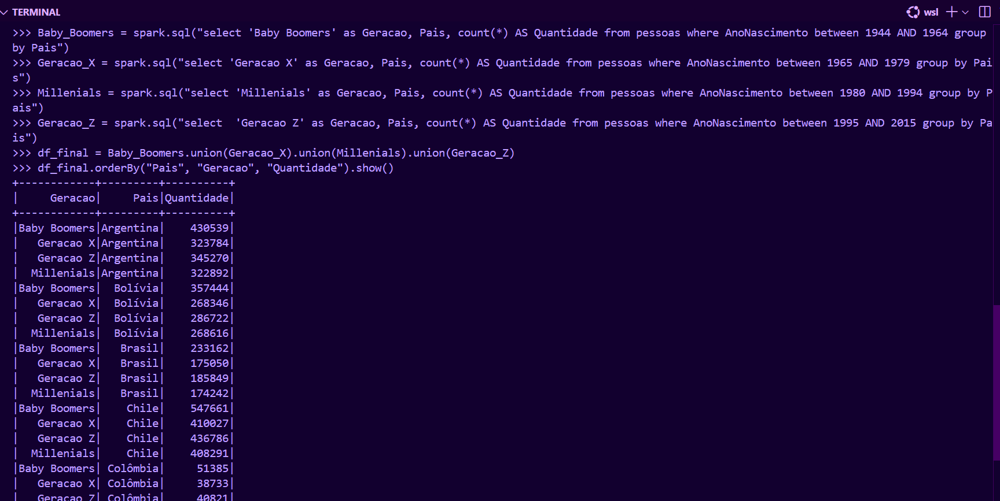

## Exercício 5 - TMDB

### Etapa 1: Criar conta

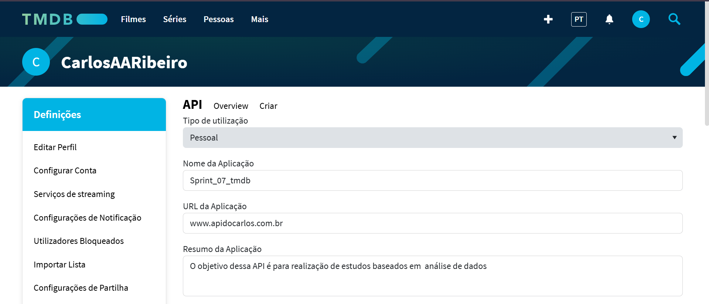

### Etapa 2: Testar credenciais

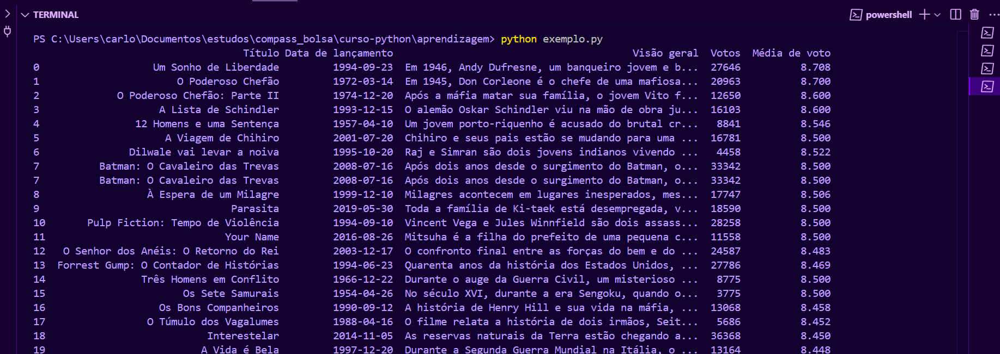

# Certificados

    Não houveram certificados extra Udemy essa Sprint.