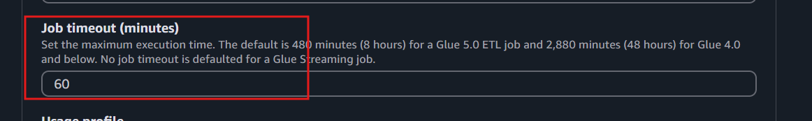
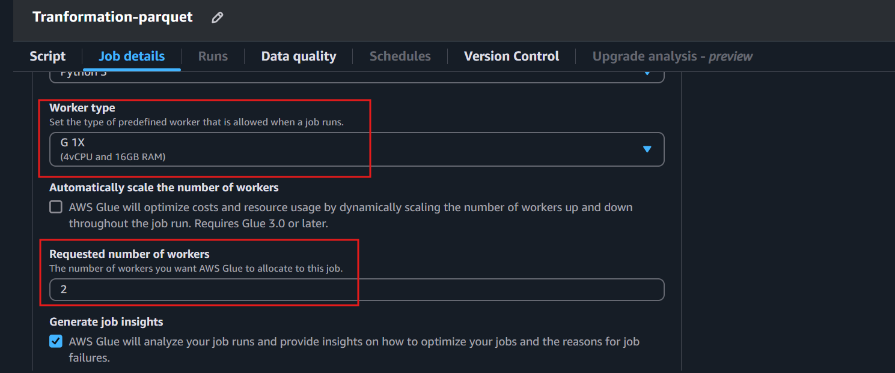
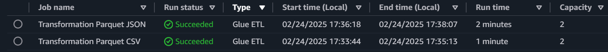
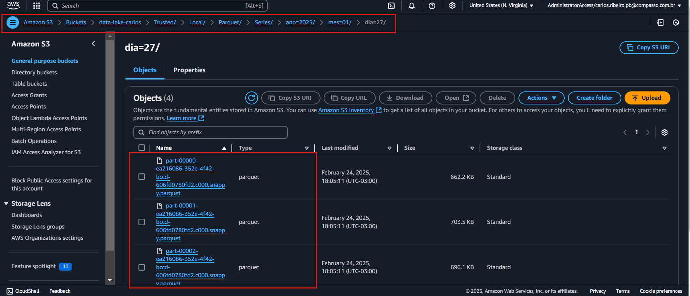
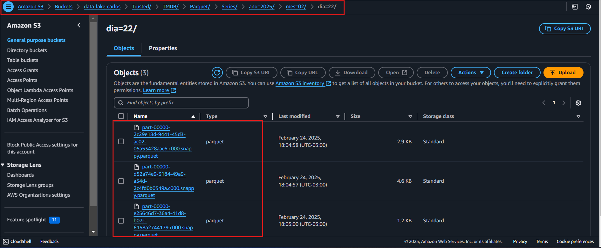

# Perguntas para serem analisadas:

    - Qual foi a trajetória de desempenho da série ao longo das temporadas?
    - Ser adicionada a Netflix trouxe impactos positivos ou negativos? 
    - A importância do personagem influencia no sucessso com o público?
    - Como Breaking Bad se compara a outras séries de crime?
    - O spin-off de Breaking Bad (Better Call Saul) teve tanto sucesso quanto a série primária? 

# Json - Criar Job para transformar os arquivos Json em parquet e guardar na camada Trusted 
    Primeiramente eu tentei fazer com que o glue lesse todos os arquivos de uma vez e fizesse as transformacões, porém como os arquivos tinham schemas diferentes, ao mesclar diversas colunas ficavam nulas, então precisei mandar ele ler e transformar um a um para fazer um parquet de cada json.

## O código usado para ler o Json no bucket e transformar em Parquet foi o seguinte:
```python 
input_path = args['S3_INPUT_PATH']
target_path = args['S3_TARGET_PATH']

# Pegar data de ingestão a partir do caminho 
match = re.search(r"/(\d{4})/(\d{2})/(\d{2})/$",input_path)
year, month, day = match.groups()

# Ler o arquivo dados_series.json
df_series = spark.read.option("multiLine", True).json(input_path + "dados_series.json")
# Adicionar colunas de partição
df_series = df_series.withColumn("ano", lit(year)).withColumn("mes", lit(month)).withColumn("dia", lit(day))
# Escrever como Parquet
df_series.write.mode("append").partitionBy("ano", "mes", "dia").parquet(target_path)

# Ler o arquivo dados_atores.json
df_atores = spark.read.option("multiLine", True).json(input_path + "dados_atores.json")
# Adicionar colunas de partição
df_atores = df_atores.withColumn("ano", lit(year)).withColumn("mes", lit(month)).withColumn("dia", lit(day))
# Escrever como Parquet
df_atores.write.mode("append").partitionBy("ano", "mes", "dia").parquet(target_path)

# Ler o arquivo dados_paises.json
df_paises = spark.read.option("multiLine", True).json(input_path + "dados_paises.json")
# Adicionar colunas de partição
df_paises = df_paises.withColumn("ano", lit(year)).withColumn("mes", lit(month)).withColumn("dia", lit(day))
# Escrever como Parquet
df_paises.write.mode("append").partitionBy("ano", "mes", "dia").parquet(target_path)

job.commit()

```

### Data
Para fazer a busca da data sem escreve-la no código (hard coder) eu utilizei de um código regex 
```
match = re.search(r"/(\d{4})/(\d{2})/(\d{2})/$",input_path)
year, month, day = match.groups()
``` 

para que a data de ingestão seja pega do caminho na camda RAW e depois a utilizei para criar colunas em todos os arquivos para fazer o particionamento.

```
df_series = df_series.withColumn("ano", lit(year)).withColumn("mes", lit(month)).withColumn("dia", lit(day))
# Escrever como Parquet
df_series.write.mode("append").partitionBy("ano", "mes", "dia").parquet(target_path)
```

## Todo o código está presente no arquivo [glue-json.py](./glue-json.py)


# CSV - Criar Job para transformar o arquivo CSV em parquet e guardar na camada Trusted 

## O código usado para ler o CSV no bucket e transformar em Parquet foi o seguinte:
```python
input_path = args['S3_INPUT_PATH']
target_path = args['S3_TARGET_PATH']

# Pegar data de ingestão a partir do caminho 
match = re.search(r"/(\d{4})/(\d{2})/(\d{2})/$",input_path)
year, month, day = match.groups()

# Ler arquivo CSV original
df = spark.read.option("header", True).option("delimiter", "|").option("inferSchema", True).csv(input_path)

# Converter coluna "genero" para StringType
df = df.withColumn("genero", col("genero").cast(StringType()))

# Filtrar dados para séries de crime
df_crime = df.filter(col("genero").contains("Crime"))

# Adicionar colunas de partição
df_crime = df_crime.withColumn("ano", lit(year)).withColumn("mes", lit(month)).withColumn("dia", lit(day))

# Escrever como Parquet
df_crime.write.mode("append").partitionBy("ano", "mes", "dia").parquet(target_path)

job.commit()

```

### Data
Para fazer a busca da data sem escreve-la no código (hard coder) eu utilizei de um código regex 
```
match = re.search(r"/(\d{4})/(\d{2})/(\d{2})/$",input_path)
year, month, day = match.groups()
``` 

para que a data de ingestão seja pega do caminho na camda RAW e depois a utilizei para criar colunas em todos os arquivos para fazer o particionamento.

```python
df_crime = df_crime.withColumn("ano", lit(year)).withColumn("mes", lit(month)).withColumn("dia", lit(day))

# Escrever como Parquet
df_crime.write.mode("append").partitionBy("ano", "mes", "dia").parquet(target_path)
```

### Usei a string "Crime" da coluna "genero" para filtrar meu csv desta maneira:
```python 
# Converter coluna "genero" para StringType
df = df.withColumn("genero", col("genero").cast(StringType()))

# Filtrar dados para séries de crime
df_crime = df.filter(col("genero").contains("Crime"))
```

## Todo o código está presente no arquivo [glue-csv.py](./glue-csv.py)

# E aqui estão as configurações pedidas no job: 

## Job Timeout



## WorkType NumberWorkers




# Jobs feitos




# Arquivos salvos nos respectivos caminhos com partições

## CSV salvo particionado



## JSONs salvos particionados

