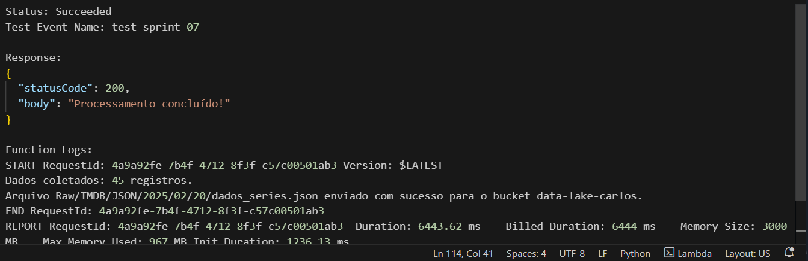
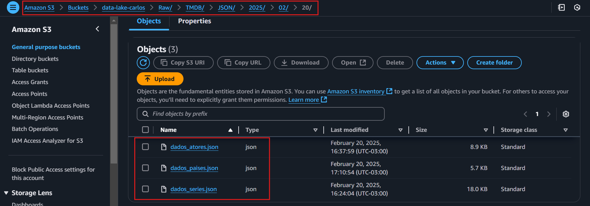

# Nessa sprint, após o monitor nos auxiliar bastante e dar bastante dicas, eu optei por mudar o foco da minha análise e montar um dashboard focado em uma série específica: Breaking Bad.
    Para isso precisei refazer os passos da sprint passada, refiz as lamdas e os códigos estão logo abaixo

## Nessa primeira lambda o foco foi pegar dados gerais que vou precisar acerca das séries que vou precisar para um análise
    Aqui eu precisei de um For para percorrer todos os ids das determinadas séries no csv e pegar o imdb(id) de cada uma para passar cada id na função que usa o imdb(id) para pegar o tmdb(id) 
    e armazena o tmdb(id) em um dicionário onde depois eu percorro esse dicionário utilizando do tmdb(id) na função que busca os dados das séries 

Aqui está o código: [lamda-series.py](./lambda-series.py)

## Nessa segunda lambda eu peguei os dados acerca dos personagens de cada temporada de Breaking Bad
    Aqui eu utilizei a chave de api, o tmdb(id) e o número da temporada para percorrer a API e buscar os dados necessários de cada personagem em cada temporada

Aqui está o código: [lambda-atores.py](./lambda-atores.py)

## Nessa última lambda eu peguei os paises onde a série é exibida
    Aqui eu utilizei uma função para acessar os dados dos países através do código da série e outra função para processar esses dados e armazená-los

Aqui está o código: [lambda-paises.py](./lambda-paises.py)

## lambda sucesso

## Dados atualizados no bucket

