# Perguntas para serem analisadas:

    - Qual foi a trajetória de desempenho da série ao longo das temporadas?
    - Ser adicionada a Netflix trouxe impactos positivos ou negativos? 
    - A importância do personagem influencia no sucessso com o público?
    - Como Breaking Bad se compara a outras séries de crime?
    - O spin-off de Breaking Bad (Better Call Saul) teve tanto sucesso quanto a série primária? 

# Job - fazer um código no glue com spark para ler os parquet na Trusted, transformar em tabelas conforme o modelo dimensional, e colocar os novos parquet na camada Refined  
    O meio que encontrei de realizar esse desafio foi mandar o spark ler arquivo por arquivo, transformar em um DF para poder realizar as transformações para as tabelas e escrever os parquet no bucket. Para isso eu criei 4 dimensões e a Fatos


## Job rodado com sucesso: 

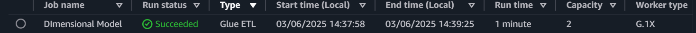


## Assim ficou o código para criação da dimensão de séries:
```python

# Ler o arquivo de series
df_series = spark.read.option("multiLine", True).parquet(input_path + "part-00000-d52a74e9-3184-49a9-a54d-2c4fd0b0549a.c000.snappy.parquet")

# Criar a dimensão série
dim_serie = df_series.select(
    F.col("id").alias("id_serie"),
    F.col("titulo").alias("titulo_serie"),
    F.col("paisOrigem").alias("codigo_pais")
)

# Escrever como Parquet
dim_serie.coalesce(1).write.mode("append").parquet(f"{target_path}/dim_serie")

```

## Assim ficou o código para criação da dimensão de personagens:
```python

# Ler o arquivo de personagens
df_personagens = spark.read.option("multiLine", True).parquet(input_path + "part-00000-2c29e18d-9441-45d3-ac02-05a53428aac6.c000.snappy.parquet")

# Criar a dimensão personagem
dim_personagem = df_personagens.select(
    F.col("idArtista").alias("id_personagem"),
    F.col("personagem").alias("nome_personagem"),
    F.col("artista").alias("nome_artista")
)

# Escrever como Parquet
dim_personagem.coalesce(1).write.mode("append").parquet(f"{target_path}/dim_personagem")
```

## Assim ficou o código para criação da dimensão de paises:
```python

# Ler o arquivo de paises 
df_paises = spark.read.option("multiLine", True).parquet(input_country + "part-00000-1eb3a45e-f79c-4aff-9699-e651dfd20580.c000.snappy.parquet")

dim_pais = df_paises.select(
    F.col("id_serie"),
    F.col("codigo_pais").alias("codigo_pais"),
    F.col("provedores").alias("plataforma")
).distinct().withColumn(
    "id_pais", F.monotonically_increasing_id() # Criar IDs únicos para cada país
)

# Escrever como Parquet
dim_pais.coalesce(1).write.mode("append").parquet(f"{target_path}/dim_pais")
```
### OBS
    Usei o "monotonically_increasing_id()" para criar IDs únicos para cada país da tabela 


## Assim ficou o código para criação da dimensão de tempo:
```python

# Criar a dimensão tempo
dim_tempo = df_series.select(
    F.col("dataLancamento").alias("data_lancamento")
).distinct().withColumn(
    "ano", F.year("data_lancamento")
).withColumn(
    "mes", F.month("data_lancamento")
).select(
    "data_lancamento", "ano", "mes"
)

# Escrever como Parquet
dim_tempo = dim_tempo.repartition("ano", "mes")
dim_tempo.write.mode("append").partitionBy("ano", "mes").parquet(f"{target_path}/dim_tempo")
```

### OBS 
    Aqui a coluna "data_lancamento" é o identificador, não vi necessidade de criar uma coluna só para ID

## Assim ficou o código para criação da Fatos:
```python

# Tabela Fatos

# Cria DF intermediario entre personagens e series para obter os IDs diferentes
df_series_personagens = df_personagens.join(
    df_series,
    df_personagens["numeroTemporada"] == df_series["numeroTemporada"],
    "inner"
).select(
    df_series["id"].alias("id_tmdb"),
    df_personagens["id"].alias("id_imdb")
)

# Criar um DataFrame que associa as séries aos países
df_series_paises = df_series_personagens.join(
    dim_pais,
    df_series_personagens["id_imdb"] == dim_pais["id_serie"],
    "left"
).select(
    df_series_personagens["id_tmdb"].alias("id_serie"),
    dim_pais["id_pais"]
)

# Adicionar o ID da tempo (data_lancamento) ao DataFrame df_series
df_series_com_tempo = df_series.join(
    dim_tempo,
    df_series["dataLancamento"] == dim_tempo["data_lancamento"],
    "inner"
).select(
    df_series["*"]
)


# Juntar os dados de séries e países
df_series_com_pais = df_series_com_tempo.join(
    df_series_paises,
    df_series_com_tempo["id"] == df_series_paises["id_serie"],
    "left"
).select(
    df_series_com_tempo["*"],
    df_series_paises["id_pais"]
)


# Criar tabela Fatos
fato_series = df_series_com_pais.join(
    df_personagens,
    df_series_com_pais["numeroTemporada"] == df_personagens["numeroTemporada"],
    "inner"
).select(
    df_series_com_pais["id"].alias("id_serie"),
    df_personagens["idArtista"].alias("id_personagem"),
    df_series_com_pais["idTemporada"].alias("id_temporada"),
    df_series_com_pais["id_pais"],
    df_series_com_pais["dataLancamento"].alias("data_lancamento"),
    df_series_com_pais["notaMedia"].alias("avaliacao"),
    df_series_com_pais["popularidade"].alias("popularidade_serie"),
    df_personagens["popularidadeArtista"].alias("popularidade_personagem"),
    df_series_com_pais["quantidadeTemporadas"].alias("numero_temporadas"),
    df_series_com_pais["quantidadeEpisodios"].alias("numero_episodios"),
    df_series_com_pais["numeroTemporada"].alias("numero_temporada"),
    df_personagens["ordemImportancia"].alias("ordem_importancia")
)


# Escrever como Parquet
fato_series.coalesce(1).write.mode("append").parquet(f"{target_path}/fato_series")
```

## Camada Refined criada:

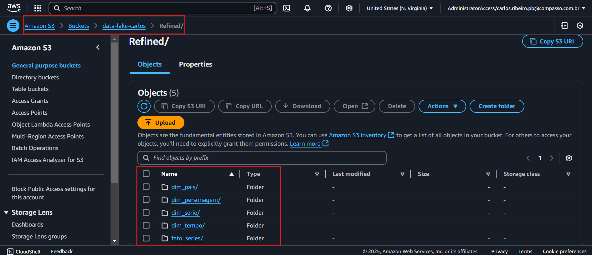


# Crawler - Após isso fiz um crawler dentro da pasta Refined para criar as tabelas a partir dos arquivos gerados

## Crawler criado e rodado:

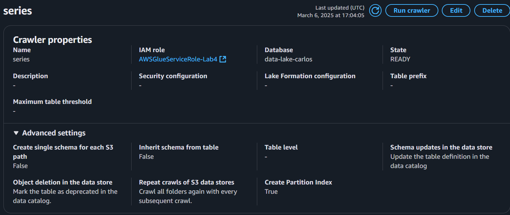


## Tabelas criadas:

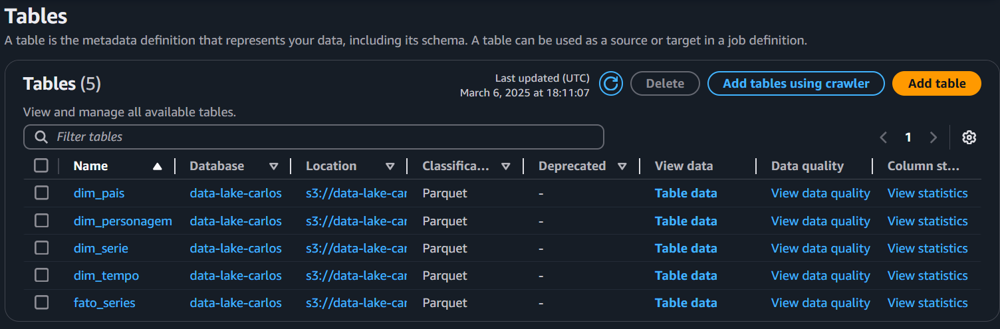


## E assim ficou a tabela da dimensão serie no Athena:

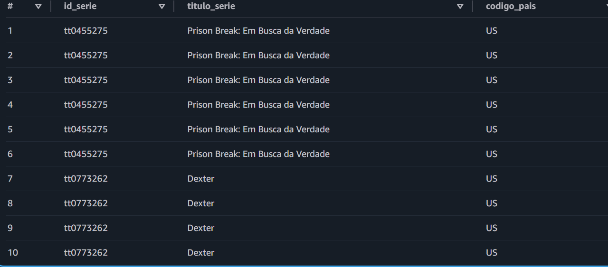


## E assim ficou a tabela da dimensão personagem no Athena:

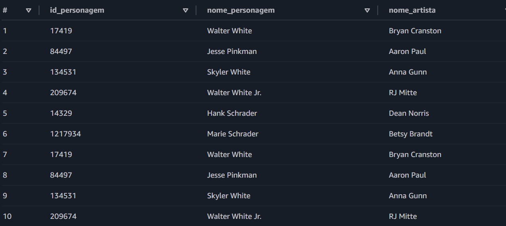

### OBS 
    Aqui os nomes se repetem várias vezes pois são todos os personagens de cada temporada de Breaking Bad

    
## E assim ficou a tabela da dimensão pais no Athena:

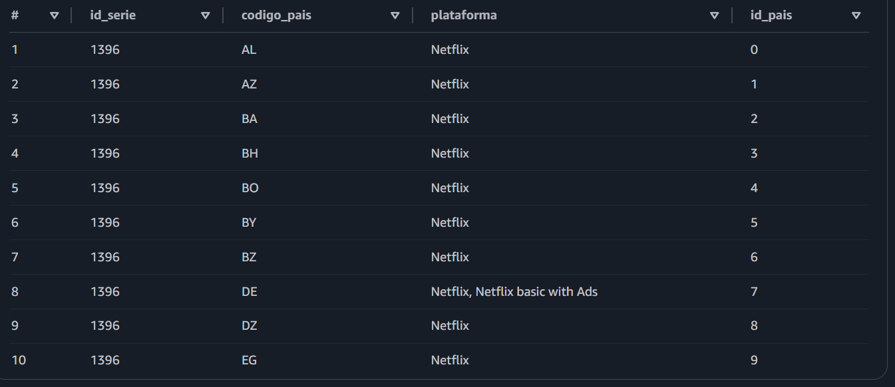


## E assim ficou a tabela da dimensão tempo no Athena:

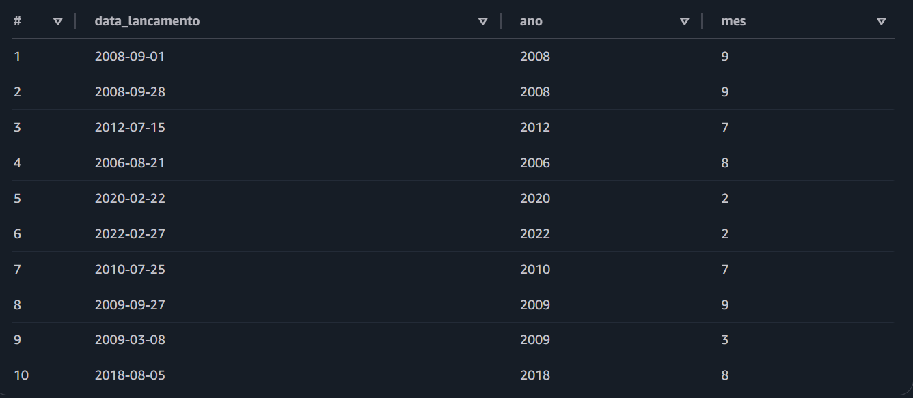


## E assim ficou a tabela fatos no Athena:

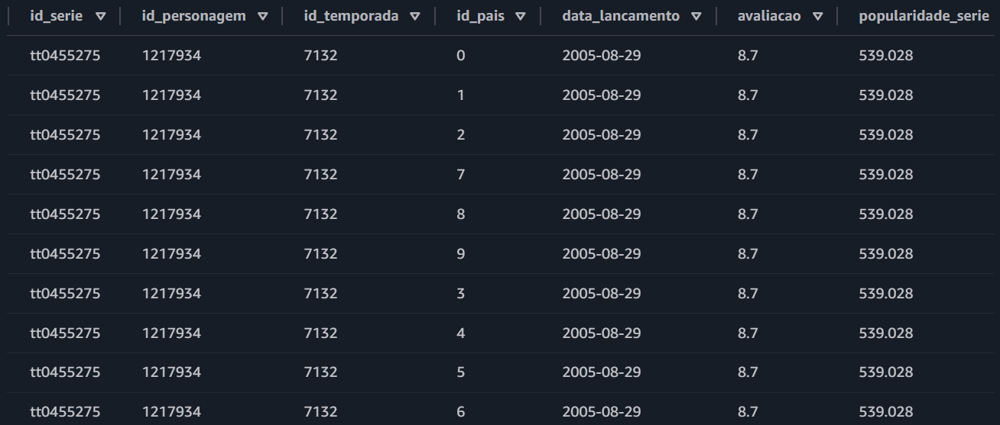

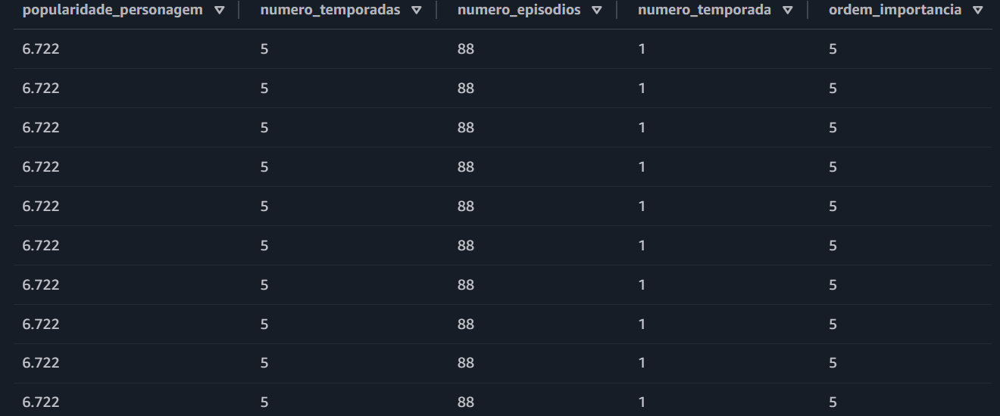


# E aqui está como ficou o esquema da modelagem dimensional:

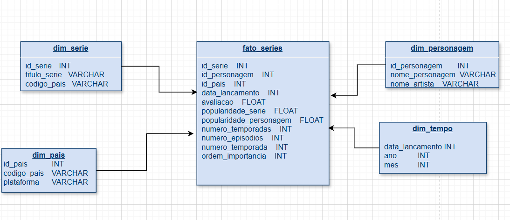
