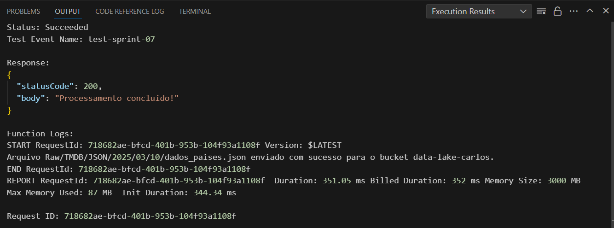
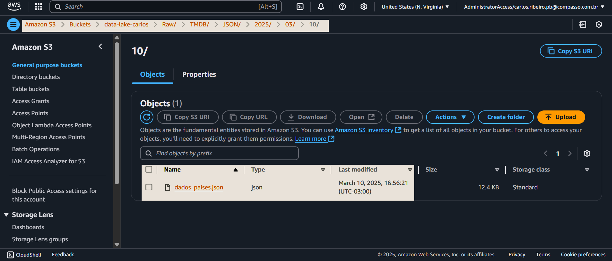
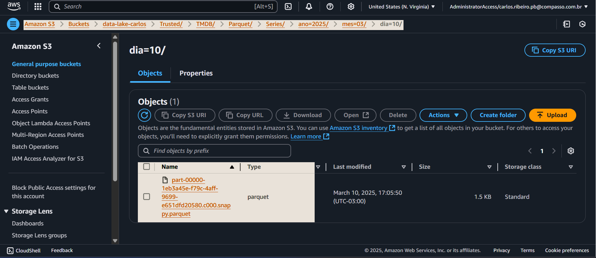

# Ao fim dessa sprint precisei refazer os dois passos anteriores para refazer o arquivo de países.

## Para isso, fiz primeiramente o código lambda para pegar o arquivo json com o dado que eu precisava: [lambda_paises](./sprint-7-lambda/lambda_paises.py) e aqui está o novo arquivo: [dados_paises.json](./sprint-7-lambda/dados_paises.json) 

### Lambda feita:

### Dados salvos: 

## Após isso refiz o job de processamento para a camada Trusted: [json-parquet.py](./sprint-8-parquet/json-parquet.py) e aqui está o arquivo parquet: [paises.parquet](./sprint-8-parquet/part-00000-1eb3a45e-f79c-4aff-9699-e651dfd20580.c000.snappy.parquet)

### Parquet atualizado:

